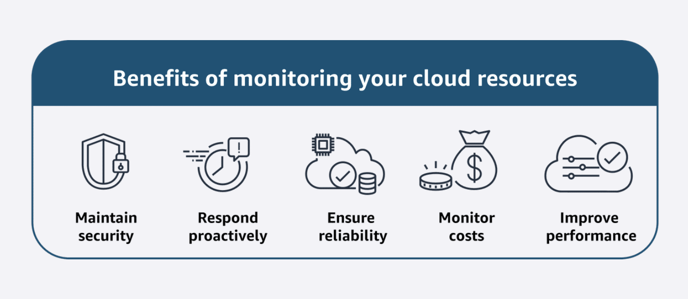
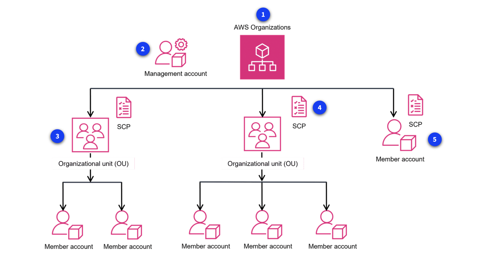

# Module 10: Monitoring, Compliance and Governance in the AWS Cloud

## Introduction to Monitoring, Compliance, and Governance in the AWS Cloud

### Monitoring your resources in the AWS Cloud

- To effectively manage AWS resources, you need ways to gain visibility into their performance, detect issues early, and resolve problems before they affect users.
- The typical governance flow is:
  1. **Secure**: protect data, systems, and infrastructure from unauthorized access, misuse, or disruption.
  2. **Monitor**: continuously observe system activity, network traffic, and security events to detect threats or anomalies.
  3. **Audit**: review controls and practices regularly to confirm that policies and procedures are being followed.
  4. **Compliance**: ensure your security practices meet regulatory, industry, and contractual requirements.

### Key takeaway / summary

- Security, monitoring, auditing, and compliance work together to strengthen AWS governance.
- Monitoring helps you detect issues early.
- Auditing confirms that controls are working.
- Compliance ensures your environment meets required standards.

---

## Introduction to Monitoring

### Importance of monitoring

Monitoring your cloud resources is essential because it helps you continuously observe system
activity, network traffic, and security events. This allows you to detect potential issues early and
maintain the security, availability, reliability, and performance of your workloads.

Monitoring is typically done through real-time monitoring tools, log collection and analysis, and
dashboards. In the following lessons, you will learn about several AWS monitoring tools and their
purposes.

### Key takeaway / summary

- Monitoring helps you observe and understand what is happening in your AWS environment.
- It improves security, reliability, and performance.
- Real-time metrics, logs, and dashboards are key monitoring tools.

---

## Amazon CloudWatch

### What is Amazon CloudWatch?

- Amazon CloudWatch is a monitoring service that helps you observe your AWS resources and applications in real time.
- It provides visibility into resource usage, application performance, and operational health.
- CloudWatch can also work with services like Amazon SNS to send notifications such as SMS alerts.

### Main CloudWatch features

1. **Metrics**
   - Collects data from AWS resources, applications, and on-premises systems.

2. **Alarms**
   - Creates threshold-based alarms that can send notifications or trigger automatic actions.

3. **Dashboards**
   - Provides customizable views to monitor resources in one place.

4. **Logs**
   - Centralizes logs from applications, systems, and AWS services for analysis.

### Benefits of CloudWatch

- Helps visualize and analyze resource health.
- Supports automation and efficient operations.
- Enables proactive monitoring and faster troubleshooting.

### Example use case

A retail company can use CloudWatch to monitor EC2 application performance, collect logs, trigger
alarms when CPU usage becomes too high, and automatically scale resources.

### Key takeaway / summary

- CloudWatch is used for monitoring metrics, logs, alarms, and dashboards.
- It helps improve visibility, automation, and troubleshooting in AWS environments.

---

## AWS CloudTrail

- CloudTrail is used to track user activity and API calls across AWS, on-premises systems, and some external environments.
- It helps answer questions such as who performed an action, what changed, and when it happened.
- This is especially useful for troubleshooting, security monitoring, compliance, and auditing.

### Main CloudTrail features

1. **CloudTrail events**
   - Records actions such as API calls and console activity.
   - Event history stores the last 90 days of management events for viewing and download.

2. **CloudTrail logs**
   - Delivers event data to Amazon S3 for long-term storage and auditing.
   - Helps support compliance requirements such as PCI and HIPAA.

3. **CloudTrail Insights**
   - Detects unusual patterns in API activity, such as sudden spikes in requests or error rates.
   - Helps identify suspicious or abnormal behavior.

### Benefits of CloudTrail

- Improves auditing and compliance evidence.
- Supports security investigations and troubleshooting.
- Helps monitor changes to AWS resources.

### Key takeaway / summary

- CloudTrail is an auditing and governance service.
- It records activity history and helps prove what happened in your AWS environment.
- CloudTrail logs and Insights support compliance and security monitoring.

---

## Compliance

### Benefits of compliance with AWS

- Compliance means that your cloud resources and data follow relevant regulations, industry standards, and internal policies for security and data protection.

- AWS helps organizations meet compliance goals by providing:
  - inherited security controls used in AWS infrastructure
  - third-party validation for many global compliance requirements
  - streamlined and automated compliance processes
  - on-demand access to compliance reports

### AWS Artifact : Complience Report

- AWS Artifact is a no-cost, on-demand service that gives access to AWS security and compliance reports and selected online agreements.
- **Benefits of AWS Artifact**
  - helps manage compliance at scale
  - saves time with on-demand report access
  - increases confidence when deploying secure solutions

- **Common use cases**
  - managing selected online agreements
  - reviewing third-party security and compliance information

### AWS Artifact types

1. **AWS Artifact Agreements**
   - Used to review, accept, and manage agreements for an individual account or all accounts in AWS Organizations.
   - Helpful for organizations subject to regulations such as HIPAA.

2. **AWS Artifact Reports**
   - Provides compliance reports from third-party auditors.
   - Can be shared with auditors or regulators as evidence of AWS security controls.

### AWS Compliance resources

- AWS also provides compliance resources such as:
  - customer compliance stories
  - whitepapers and documentation
  - guidance on risk, auditing, and security best practices

### Key takeaway / summary

- Compliance in AWS means meeting legal, regulatory, and security expectations.
- AWS Artifact helps access reports and agreements.
- AWS provides tools and documentation to support governance and compliance efforts.

---

## Auditing AWS Resources for Compliance

Organizations often need to follow specific configuration rules for their AWS resources. To ensure
compliance, they use tools that assess and audit resource settings over time.

### AWS Config

- AWS Config is a service that evaluates, audits, and monitors the configuration of AWS resources.

- **Benefits of AWS Config**
  - Checks resource configurations against a desired state
  - Tracks configuration changes over time
  - Helps with troubleshooting and remediation

- **Common use cases**
  - Continuous auditing of resource settings
  - Security monitoring and analysis
  - Operational troubleshooting and change management

### AWS Audit Manager

- AWS Audit Manager a fully managed service helps automate and simplify compliance audits by collecting evidence and managing audit data.

- **Benefits of AWS Audit Manager**
  - Automates evidence collection
  - Improves collaboration across teams
  - Helps maintain audit integrity with read-only permissions

- **Common use cases**
  - Automating evidence collection
  - Continuous compliance assessment
  - Internal risk and audit reviews

### Key takeaway / summary

- AWS Config helps track and evaluate resource configuration.
- AWS Audit Manager helps automate compliance evidence collection and audit management.

---

## AWS Organizations (Account Management Service)

- As companies grow, managing many AWS accounts can become difficult. AWS Organizations helps you govern multiple accounts from a central place.

- AWS Organizations lets you centrally manage and govern your AWS environment as it scales. It helps with policy management, account creation, and shared governance across accounts.

- **Benefits of AWS Organizations**
  - Quickly creates new AWS accounts for teams or projects
  - Simplifies permission management using SCPs
  - Helps manage and optimize costs across accounts
  - Supports centralized access and governance

- **Common use cases**
  - Automating account creation
  - Providing access to security teams
  - Controlling access to specific services
  - Sharing common resources across accounts

### Key concepts

1. **Organization**
   - A collection of AWS accounts managed from one central location.
   - Accounts can be grouped in a hierarchy with a root and organizational units (OUs).

2. **Management account**
   - The main account that creates and manages the organization.
   - It provides overall governance and control.

3. **Organizational unit (OU)**
   - A logical grouping of accounts inside an organization.
   - OUs can contain member accounts or nested OUs.

4. **Service control policies (SCPs)**
   - Policies that restrict what users and roles can do in member accounts.
   - SCPs can be applied to OUs or individual accounts.
   - An SCP is a policy that lets you place restrictions on the AWS services, resources, and individual API actions that users and roles in each account can access. SCPs can be applied to either OUs or individual member accounts.

5. **Member account not in an OU**
   - A member account can still be part of the organization even if it is not placed under an OU.
   - It can still benefit from consolidated billing and centralized governance.

### Key takeaway / summary

- AWS Organizations helps manage multiple AWS accounts centrally.
- It supports governance, policy enforcement, and scalable account management.

---

## AWS Service Control Policies (SCPs)

- A Service Control Policy (SCP) is a policy in AWS Organizations that defines the maximum permissions available to accounts in an organization.

> SCPs set permission boundaries, not permissions.

- Purpose of SCPs
  - Control permissions across multiple AWS accounts
  - Enforce organization-wide security policies
  - Restrict access to AWS services and actions

- SCPs can be attached to:
  - the root of the organization
  - an organizational unit (OU)
  - an individual AWS account

- They cannot be attached to IAM users, groups, or roles.

### How SCPs work

- SCPs do not grant permissions. They only allow or deny what IAM users and roles can potentially do.

- Actual access is the intersection of:
  - IAM permissions
  - SCP permissions

Both must allow the action.

- **Example**: If IAM allows EC2, S3, and RDS, but the SCP allows only EC2 and S3, then RDS will be blocked.

### Key takeaway / summary

SCP = Stop, Control, Protect

---

## Governance

### Governance in the AWS Cloud

- Governance services help organizations enforce policies, standardize account setup, and manage resources consistently across AWS.
- The three main services in this section are:
  - **AWS Control Tower**
  - **AWS Service Catalog**
  - **AWS License Manager**

### AWS Control Tower

AWS Control Tower helps you set up and govern a secure, compliant, multi-account AWS environment
using best practices.

- **Key features**
  - **Dashboard**: provides visibility into provisioned accounts and policy enforcement
  - **Account Factory**: standardizes the creation of new accounts
  - **Controls / Guardrails**: enforce high-level governance rules
  - **Landing zone**: provides a well-architected multi-account environment for compliance and security

- **Benefits**
  - Speeds up multi-account setup
  - Enforces governance at scale
  - Supports security and compliance requirements

### AWS Service Catalog

- AWS Service Catalog lets you create and share a curated catalog of approved AWS resources and services.
- With Service Catalog, you can create, share, and organize from a curated catalog of AWS resources. You can deploy baseline networking resources and security tools for new AWS accounts so that you can govern consistently.

- **Benefits**
  - Makes approved resources easy to find and deploy
  - Improves consistency across accounts
  - Supports self-service provisioning with governance

- **Common use cases**
  - Provisioning approved networking and security resources
  - Managing access to approved services
  - Speeding up CI/CD resource deployment

### AWS License Manager

AWS License Manager helps organizations manage software licenses and reduce compliance risk.

- **Benefits**
  - Improves visibility and control of software licenses
  - Helps track license usage and reduce noncompliance
  - Supports BYOL and license mobility scenarios

- **Common use cases**
  - Managing Microsoft and other vendor licenses
  - Automating entitlement distribution
  - Enforcing usage limits across accounts

### Key takeaway / summary

- AWS Control Tower governs multi-account environments.
- AWS Service Catalog provides approved self-service resources.
- AWS License Manager helps manage software licenses and reduce compliance risk.

---

## AWS Health

- AWS Health provides information about events and changes that may affect the health of your AWS resources. It helps you stay informed about service issues, planned changes, and account-specific notifications.

- **Key features**
  - Provides updates on service events and planned changes
  - Shows account-specific health information
  - Can be accessed through the AWS Health Dashboard or AWS Health API

- **Benefits**
  - Helps you respond quickly to issues
  - Gives actionable guidance for remediation
  - Supports operational awareness and incident planning

### Key takeaway / summary

- AWS Health helps you monitor and respond to service-related issues affecting your AWS environment.

---

## AWS Trusted Advisor

- AWS Trusted Advisor continuously evaluates your AWS environment against AWS best practices in areas such as security, cost optimization, performance, and resilience.
- Trusted Advisor helps you optimize costs, increase performance, improve security and resilience, and operate at scale in the cloud.

- **Key features**
  - Checks your environment against best-practice recommendations
  - Helps identify cost-saving and performance improvements
  - Provides insights across several categories

- **Benefits**
  - Improves security and efficiency
  - Helps prioritize recommendations
  - Supports optimization at scale

### IAM Access Analyzer

- IAM Access Analyzer helps review and refine IAM permissions by identifying external access and validating policy intent.

- **Benefits of IAM Access Analyzer**
  - Improves least-privilege access
  - Helps validate IAM policies
  - Identifies overly broad access

### Key takeaway / summary

- Trusted Advisor helps optimize your AWS environment.
- IAM Access Analyzer helps refine permissions and strengthen security.

---
