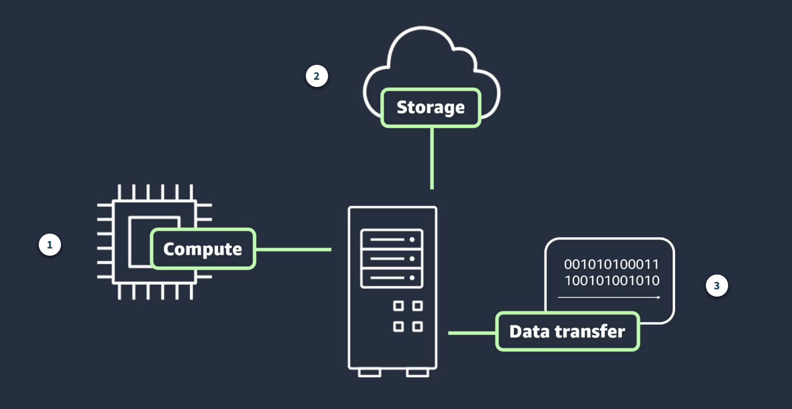
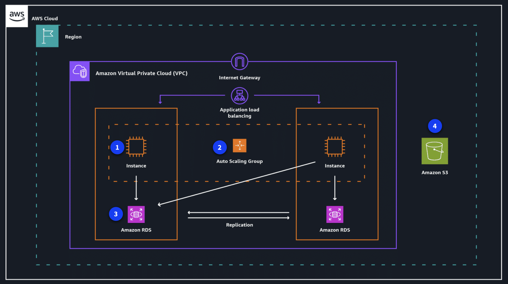

# Module 11: Pricing and Support

## Introduction to Pricing and Support

AWS pricing, AWS support, and cost optimization all work together to help you manage cloud spend
effectively. In this module, you will learn how AWS charges for services, which tools help you track
costs, what support options are available, and how to reduce unnecessary spending.

### Key takeaway / summary

- AWS uses a flexible pricing model that helps you pay only for what you use.
- Cost management tools help you monitor, forecast, and control spending.
- Support plans and partner resources help you get help when you need it.

---

## AWS Pricing Concepts

AWS uses a pay-as-you-go model for most services. This means you pay only for the resources you use,
for as long as you use them, without long-term commitments or complex licensing.

### Core pricing concepts

1. **Pay as you go**
   - You can scale resources up or down based on demand.
   - This reduces the risk of overprovisioning or missing capacity.

2. **Save when you commit**
   - Some services offer Savings Plans or Reserved Instances for longer-term commitments.
   - These options can lower costs compared with On-Demand pricing.

3. **Pay less by using more**
   - Some services use tiered pricing, so the more you use, the lower the unit cost becomes.

### Main drivers of AWS cost

AWS costs are influenced by three major factors:

- **Compute**: You pay for processing time, often by the hour or second.
- **Storage**: Cost depends on how much data you store and how it is accessed.
- **Data transfer**: Outbound data transfer is typically charged, while inbound transfer is usually free.

### Example: Amazon EC2 scenario

An organization running an online donation application might choose an EC2 instance based on its
compute needs. The cost is affected by:

- **Compute**: The instance type and size, such as a low-cost t4g.nano instance.
- **Storage**: The amount of EBS storage attached to the instance.
- **Data transfer**: Outbound traffic sent to another service for analytics.

### Key takeaway / summary

- AWS pricing is mainly driven by compute, storage, and outbound data transfer.
- Choosing the right instance size and storage options can significantly affect cost.

---

## AWS Pricing and Billing Services

- AWS provides several tools to help you plan, track, and manage costs.
  1.  **AWS Organizations**
      - Centralizes billing and account management for multiple AWS accounts.
      - Helps apply organization-wide policies and simplify governance.

  2.  **AWS Billing and Cost Management dashboard**
      - Shows current charges, usage, forecasts, and cost breakdowns.
      - Helps you manage payment methods, invoices, and billing details.

  3.  **AWS Budgets**
      - Lets you set spending thresholds and receive alerts.
      - Useful for avoiding unexpected cost increases.

  4.  **AWS Cost Explorer**
      - Provides charts and reports to analyze historical spending.
      - Helps identify trends and cost-saving opportunities.

  5.  **AWS Pricing Calculator**
      - Allows you to estimate costs before deploying resources.
      - Useful for comparing different configurations and services.

### Key takeaway / summary

- Billing tools help you forecast, track, and control AWS spend more effectively.
- The AWS Pricing Calculator is especially useful before deployment.

---

## AWS Support Plans

AWS offers support plans that range from basic self-service help to highly personalized enterprise
support.

### Support plan overview

- **Basic Support**
  - Included for all AWS customers.
  - Provides access to documentation, whitepapers, and AWS re:Post.

- **Developer Support**
  - Recommended for testing and development.
  - Includes faster response times for impaired systems.

- **Business Support**
  - Recommended for production workloads.
  - Includes more comprehensive support and faster response times.

- **Enterprise On-Ramp Support**
  - Designed for business-critical production environments.
  - Includes more proactive guidance and support.

- **Enterprise Support**
  - Best for mission-critical workloads.
  - Includes the highest level of support and a designated technical account manager.

> Note: In the course materials, Developer, Business, and Enterprise On-Ramp support plans are noted as being discontinued on January 1, 2027.

### Additional support resources

- **AWS re:Post**: A community Q&A platform for AWS questions and solutions.
- **AWS Trust and Safety Center**: Helps report suspicious or abusive activity.
- **AWS Solutions Architects**: Provide architectural guidance for Business and Enterprise customers.
- **AWS Professional Services**: Offers deeper consulting support for complex projects.
- **AWS documentation**: A large self-service library for troubleshooting and learning.

### Key takeaway / summary

- Support plans vary based on workload criticality and business needs.
- AWS also offers documentation, expert guidance, and consulting resources beyond the basic support tier.

---

## AWS Marketplace and AWS Partner Network

### AWS Marketplace

- The AWS Marketplace is a digital catalog of software solutions from independent vendors. It helps
  customers find, test, and buy software that runs on AWS.

- **Common categories include**:
  - **Software as a Service (SaaS)**: business apps, collaboration tools, and marketing platforms.
  - **Machine learning and AI**: prebuilt models and ML tools.
  - **Data and analytics**: BI tools, reporting platforms, and integration services.

### AWS Partner Network (APN)

- The APN is a global community of partners that build solutions and services on AWS. Working with
  partners can help organizations solve technical problems and accelerate implementation.
- **Benefits of becoming an AWS Partner include**:
  - funding opportunities
  - partner events and training
  - access to AWS programs and certification resources

### Key takeaway / summary

- AWS Marketplace helps you discover ready-made software solutions.
- AWS Partners can help you build and scale solutions more effectively.

---

## Cost Optimization

Cost optimization is about using the right resources, at the right size, and for the right purpose.

### Common cost optimization strategies

1. **Amazon EC2**
   - Rightsize instances to match workload needs.
   - Use Spot Instances for flexible, interruption-tolerant workloads.

2. **Auto Scaling**
   - Automatically add or remove capacity based on demand.
   - Helps avoid paying for unused resources.

3. **Amazon RDS**
   - Use storage autoscaling to avoid overprovisioning.
   - Use read replicas to reduce pressure on the primary database.
   - Use services like Amazon ElastiCache to improve performance and lower database load.

4. **Amazon S3**
   - Choose the right storage class for access patterns.
   - Use S3 Glacier Deep Archive for rarely accessed data.
   - Use S3 Intelligent-Tiering for workloads with changing access patterns.
   - Use VPC endpoints to reduce data transfer costs.

### Key takeaway / summary

- Cost optimization focuses on rightsizing, automation, and choosing the best service options for your workload.
- Smart storage and compute choices can significantly reduce AWS spend.

---
