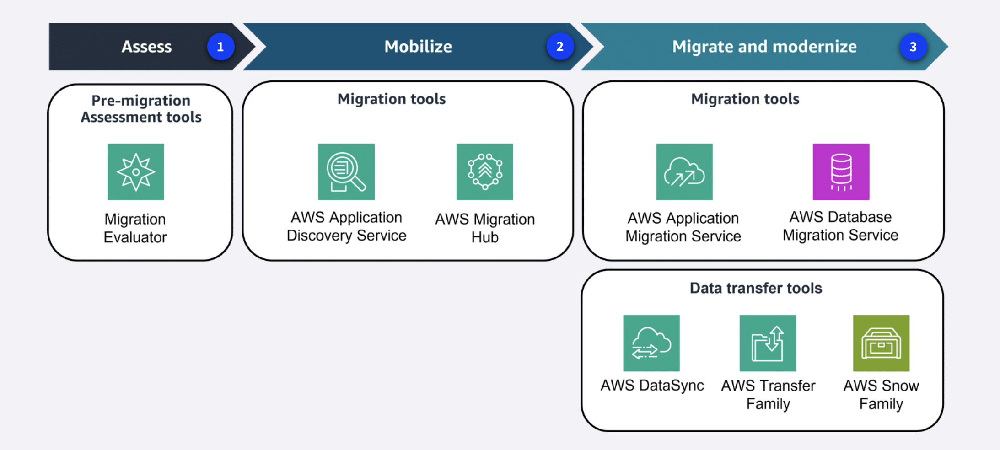
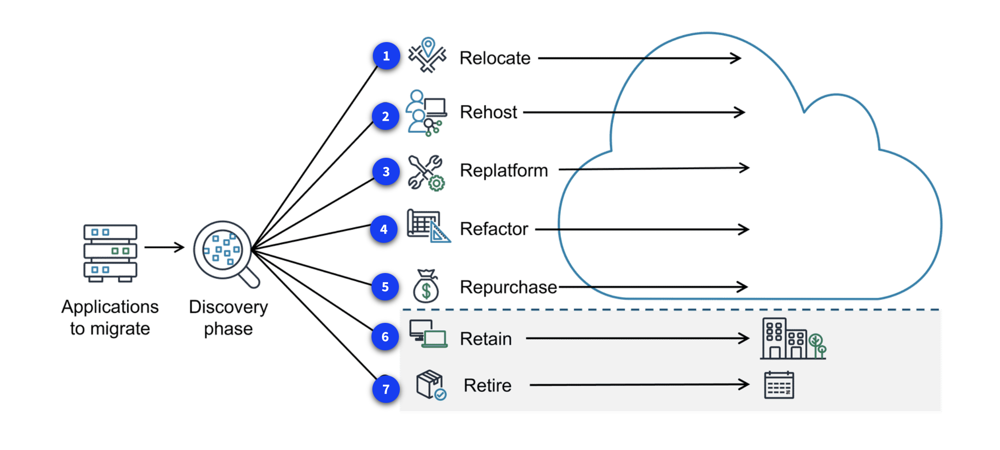

# Module 12: Migrating to the AWS Cloud

## Introduction to Migration

- Cloud migration is the process of moving an organization’s digital assets, applications, databases, and IT resources from on-premises infrastructure to the AWS Cloud.
- It usually involves planning, execution, and ongoing management rather than a single one-time move.

### Three phases of the migration process

- AWS guides customers through migration in three main phases:
  1.  **Assess**
      - Build the business case for migration.
      - Evaluate readiness and current infrastructure.
      - **Example service**: **Migration Evaluator**.

  2.  **Mobilize**
      - Prepare the organization and gather the resources needed.
      - Identify dependencies and create a migration plan.
      - **Example services**: **AWS Application Discovery Service** and **AWS Migration Hub**.

  3.  **Migrate and modernize**
      - Move workloads and improve applications during the transition.
      - **Example services**: **AWS Application Migration Service** and **AWS Database Migration Service (AWS DMS)**.
      - Data transfer tools may include **AWS DataSync**, **AWS Transfer Family**, and the **AWS Snow Family**.

### Key takeaway / summary

- Migration is usually done in stages rather than as a single event.
- AWS provides services for assessment, planning, migration, and modernization.

---

## AWS Cloud Adoption Framework (AWS CAF)

- The AWS Cloud Adoption Framework helps organizations prepare for cloud adoption by providing best practices, guidance, and a structured approach to migration.

- **Why AWS CAF matters**
  - Reduces business risk.
  - Improves governance, transparency, and sustainability.
  - Helps organizations optimize operations and improve customer experience.
  - Supports migration of both technology and business processes.

### Key stakeholder perspectives

There are several groups of stakeholders and parts of the business to consider in migration planning and readiness.

1. **Business**
   - The Business perspective makes sure IT aligns with business needs and that IT investments support key business outcomes.
   - Use this perspective to create a strong business case for cloud adoption and prioritize cloud adoption initiatives.
   - **Common Business perspective roles include**:
     - Business managers
     - Finance managers
     - Budget owners
     - Strategy stakeholders

2. **People**
   - The People perspective supports the development of an organization-wide change management strategy for successful cloud adoption.
   - Use it to evaluate organizational structures, roles, and skill gaps, and to identify training and staffing needs.
   - **Common People perspective roles include**:
     - Human resources
     - Staffing
     - People managers

3. **Governance**
   - The Governance perspective focuses on the skills and processes needed to align IT strategy with business strategy.
   - It helps maximize business value and minimize risk while managing and measuring cloud investments.
   - **Common Governance perspective roles include**:
     - Chief information officer (CIO)
     - Program managers
     - Enterprise architects
     - Business analysts
     - Portfolio managers

4. **Platform**
   - The Platform perspective includes principles and patterns for implementing new solutions in the cloud and migrating on-premises workloads.
   - It helps describe the architecture of the target environment and communicate how IT systems relate to one another.
   - **Common Platform perspective roles include**:
     - Chief technology officer (CTO)
     - IT managers
     - Solutions architects

5. **Security**
   - The Security perspective ensures the organization meets security objectives for visibility, auditability, control, and agility.
   - AWS CAF helps structure the selection and implementation of security controls that fit the organization’s needs.
   - **Common Security perspective roles include**:
     - Chief information security officer (CISO)
     - IT security managers
     - IT security analysts

6. **Operations**
   - The Operations perspective helps enable, run, use, operate, and recover IT workloads to the level agreed upon with business stakeholders.
   - It defines how day-to-day and long-term business operations are conducted and how cloud adoption will affect current processes.
   - **Common Operations perspective roles include**:
     - IT operations managers
     - IT support managers

### Key takeaway / summary

- AWS CAF helps organizations plan migration in a structured and business-focused way.
- It brings together people, process, security, and platform concerns.

---

## Seven Migration Strategies (the 7 Rs)

- Organizations can choose different migration strategies depending on application complexity, business goals, timeline, and available resources.

1.  **Relocate**
    - Move existing applications or workloads to the cloud without changing their hosting model.

2.  **Rehost**
    - Also called “lift-and-shift.”
    - Move applications to AWS with minimal or no changes.

3.  **Replatform**
    - Also called “lift, tinker, and shift.”
    - Make small optimizations to gain cloud benefits without redesigning the whole application.

4.  **Refactor**
    - Re-architect applications to use cloud-native features.
    - Best when major scale, performance, or feature improvements are needed.

5.  **Repurchase**
    - Replace traditional software with a SaaS solution.
    - **Example**: moving from a legacy CRM to a cloud-based CRM product.

6.  **Retain**
    - Keep some applications in the source environment for now.
    - Useful when an application is too critical or too complex to migrate immediately.

7.  **Retire**
    - Remove applications that are no longer needed.

### Key takeaway / summary

- The 7 Rs help organizations choose the best migration path for each workload.
- Different applications may use different strategies within the same migration plan.

---

## Migration Services and Tools

- AWS provides several services that support migration at different stages.

1. **Assess phase**
   1. **AWS Migration Evaluator**
      - Helps create a business case for migration.
      - Uses data-driven analysis to estimate current and future cloud costs.
      - Supports discovery, licensing review, and migration readiness planning.

2. **Mobilize phase**
   1. **AWS Application Discovery Service**
      - Discovers on-premises servers, databases, and connections.
      - Collects configuration, performance, and dependency information.
      - Helps build a detailed migration plan.

   2. **AWS Migration Hub**
      - Centralizes migration tracking and planning.
      - Helps teams coordinate discovery, assessment, execution, and modernization.
      - Provides guidance and collaboration tools.

3. **Migrate and modernize phase**
   1. **AWS Application Migration Service**
      - Helps migrate applications to AWS while minimizing disruption.
      - Supports modernization during the migration journey.

### Additional migration support

- **AWS Migration and Modernization Competency Partners** can provide expertise and implementation support.

### Key takeaway / summary

- AWS offers tools for assessment, discovery, planning, migration, and modernization.
- Migration Hub is a central place to manage the overall migration journey.

---

## Database Migrations

- Database migration can involve moving to a managed AWS database, changing database engines, or
  modernizing the architecture.

- **Types of database migration**
  1. **Homogeneous migration**: moving between the same database engine types.
  2. **Heterogeneous migration**: moving between different database engines.

- **AWS Database Migration Service (AWS DMS)**
  - Helps migrate databases quickly and securely.
  - Supports ongoing replication for live databases and data warehouses.
  - Useful for both homogeneous and heterogeneous migrations.
  - Helps reduce downtime and support high availability.

- **AWS Schema Conversion Tool (AWS SCT)**
  - Converts database schemas and code objects from one database engine to another.
  - Useful when moving from commercial databases to open-source databases.
  - Saves time compared with manual conversion.

### Key takeaway / summary

- AWS DMS handles database migration and replication.
- AWS SCT helps convert schemas and database objects when engines differ.

---

## Transferring Data Online

- Online data transfer is often used when there is sufficient bandwidth and internet connectivity.
- **Common migration considerations**:
  - Security
  - Data validation
  - Scheduling and tracking
  - Bandwidth requirements

### AWS services for online transfer

1. **AWS DataSync**
   - Automates and accelerates data movement between on-premises storage and AWS storage services such as Amazon S3.
   - Helps with encryption, scheduling, throttling, and reporting.

2. **AWS Transfer Family**
   - Provides managed file transfer support for protocols such as FTP, SFTP, and FTPS.
   - Transfers files securely into and out of services like Amazon S3 and Amazon EFS.

3. **AWS Direct Connect**
   - Provides a dedicated private connection between on-premises networks and AWS.
   - Offers a fast, reliable, and secure way to transfer large amounts of data.

### Key takeaway / summary

- DataSync is commonly used for large-scale online data migration.
- Direct Connect is ideal when a dedicated private connection is needed.

---

## Transferring Data Offline

- Offline migration is used when internet connectivity is limited, bandwidth is low, or large amounts
  of data need to be moved physically.

- **AWS Snowball Edge Storage Optimized**
  - A physical device used to transfer large amounts of data offline.
  - Useful when transferring multi-petabyte datasets or when internet-based transfer is impractical.
  - Can also be used for edge computing in secure or rugged locations.

### Key takeaway / summary

- Snowball Edge is the main AWS option for offline data migration.
- It is especially useful when network constraints make online transfer impractical.

---
