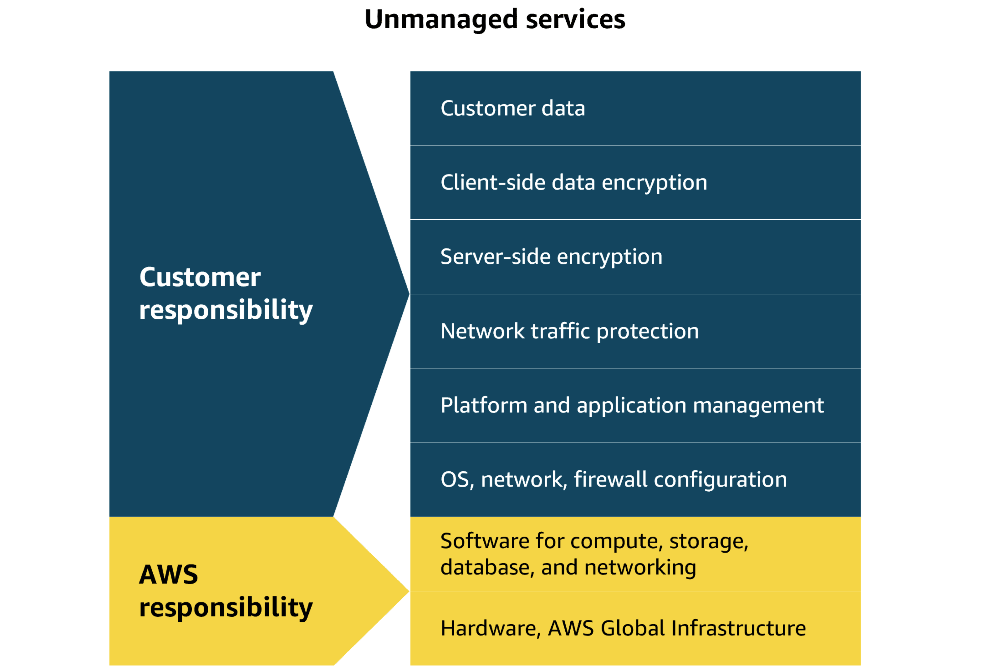

# Module 2: Compute in the Cloud

## EC2 (Elastic Compute Cloud)

EC2 provides **virtual machines in AWS**.

- Compute refers to the processing power needed to run applications, manage data, and perform calculations. 
- In the cloud, this power is available on-demand. You can access it remotely without owning or maintaining physical hardware. 
- Amazon EC2 is more flexible, cost-effective, and faster than managing on-premises servers. It offers on-demand compute capacity that can be quickly launched, scaled, and terminated, with costs based only on active usage.
- The flexibility of Amazon EC2 allows for faster development and deployment of applications. You can launch as many or as few virtual servers as needed and configure security, networking, and storage. You can also scale resources up or down based on usage, such as handling high traffic or compute-heavy tasks.

---

### EC2
1. Highly flexile
2. Cost-effective
3. Quick

- AWS built and secured data centers.
- AWS purchased and installed servers.
- The servers are online and ready to use.
- Pay for what you use


### EC2 Instance
- Pay for what you use
- EC2 instance are virtual machine or VM's are in Multitendancy enviorment, that is, Each virtual machine is isolated but shares resources from a host machine.
    - (Multitenancy: Sharing underlying hardware between virtual machines.)
- EC2 instance are resizalble (vertical scaling)


### EC2 Uses

- Running applications
- Hosting websites
- Data processing


### EC2 Related Services

- **EBS** – Persistent storage
- **ELB** – Load balancing
- **Auto Scaling Group (ASG)** – Automatic scaling of instances


### EC2 Configuration

When launching an EC2 instance you configure:

- Operating system (Linux, Windows, macOS)
- CPU
- RAM
- Storage
- Network
- Security groups


#### Compute as a Service : AWS makes easy to accure server by this.


---


### How Amazon EC2 works

1. **Launch an instance** 
- When launching an EC2 instance, you start by selecting an Amazon Machine Image (AMI), which defines the operating system and might include additional software. You also choose an instance type, which determines the underlying hardware resources, such as CPU, memory, and network performance.

2. **Connect to the instance**
    - You can connect to an EC2 instance in various ways. Applications can interact with services running on the instance over the network.
    - Users or administrators can connect using SSH for Linux instances or Remote Desktop Protocol (RDP) for Windows instances. Alternatively, AWS services like AWS Systems Manager offer a secure and simplified method for accessing instances.

3. **Use the instance**
    - After you are connected to the instance, you can begin using it to run commands, install software, add storage, organize files, and perform other tasks.

---


### EC2 User Data

User Data scripts allow **automatic commands at instance startup**.

Used for:

- Installing software
- Updating packages
- Downloading files
- Bootstrapping applications

Requires **root access**.

---

### EC2 Instance Types

1. Amazon EC2 offers a broad range of instance types, each tailored to meet specific use case requirements. 
2. These instances come with varying combinations of CPU, memory, storage, and networking capabilities, so you can choose the right mix of resources to optimize performance for your applications.
3. Each Amazon EC2 instance type is grouped under an instance family


#### Amazon EC2 instance families (IMP)

1. **General Purpose**
    - Balanced Resources:
        - Compute
        - Memory
        - Networking
    - Examples:
        - Web servers
        - Application servers
        - Code repositories


2. **Compute Optimized**
    - Best for **compute-intensive workloads**.
    - Examples:
        - Batch processing
        - Media transcoding
        - High performance web servers
        - Scientific modeling
        - Machine learning
        - Gaming servers
    - Compute optimized instances are specifically designed for compute-heavy workloads like simulations, offering higher CPU performance to process complex algorithms and analyze large datasets.

3. **Memory Optimized**
    - Best for **large in-memory workloads**.
    - Examples:
        - High performance databases
        - In-memory caches
        - Real-time big data processing
        - Business intelligence systems

4. **Storage Optimized**
    - Best for **high read/write storage workloads** of locally stored data.
    - Examples:
        - OLTP databases
        - NoSQL databases
        - Data warehousing
        - Distributed file systems

5. **Accelerated computing**
    - Use **Hardware Accelerators**, like graphics processing units (GPUs)
    - Examples:
        - Floating point number calculations
        - Graphics processing
        - Data pattern matching


---


### EC2 Instance Naming Convention

Example:

```
m5gn.2xlarge
```

| Part    | Meaning               |
|---------|-----------------------|
| m       | Instance class/series |
| 5       | Generation            |
| gn      | Options               |
| 2xlarge | Instance size         |


---

### EC2 Security Groups

Security groups act as **virtual firewalls for EC2 instances**.

- **Security Group Features**
    - Control inbound traffic
    - Control outbound traffic
    - Allow rules only (no deny rules)
    - Can reference IP or other security groups

    - **Key Characteristics**
        - Attached to multiple instances
        - Region / VPC specific
        - Operate outside the EC2 instance


#### Default Security Group Rules

| Traffic Type | Default Rule |
|--------------|--------------|
| Inbound      | Blocked      |
| Outbound     | Allowed      |

---

#### Important Ports


| Port | Protocol | Use                       |
|------|----------|---------------------------|
| 21   | FTP      | File transfer             |
| 22   | SSH      | Login to Linux instance   |
| 22   | SFTP     | Secure file transfer      |
| 80   | HTTP     | Unsecured website         |
| 443  | HTTPS    | Secure website            |
| 3389 | RDP      | Login to Windows instance |

---

### Interacting with AWS Services

1. AWS Management Console (Browser Based)
    - It is usefull for : 
        - Set up test environments
        - View AWS bills
        - View monitoring
        - Work with non-technical resources


2. AWS Command Line Interface (CLI)
    - Make API calls using the terminal on your machine.
    - You can automate tasks through scripts, such as launching EC2 instances.


3. AWS Software Development Kit (SDK)
    - Interact with AWS resources through various programming languages.

--- 

### Shared Responsibility Model for EC2


- The customer is responsible for configuring, securing, and managing the operating system, networking, and applications on their EC2 instances.

- An unmanaged service like Amazon EC2 requires you to perform all of the necessary security configuration and management tasks. When you deploy an EC2 instance, you are responsible for configuring security, managing the guest operating system (OS), applying updates, and setting up firewalls (security groups). 




---

### What are the required configurations when launching an Amazon EC2 instance for a web serve

1. AMI (Amazon Machine Image)
2. Intance Type
3. Storage
    

- To launch an EC2 instance for a web server, configure the AMI to define the operating system and software; select the instance type to allocate CPU, memory, and storage; and set up storage options, including the type and size of the volume.

---
### AMI (Amazon Machine Images)

- **AMI components** : An AMI includes the operating system, storage setup, architecture type, permissions for launching, and any extra software that is already installed. You can use one AMI to launch several EC2 instances that all have the same setup.

- Three ways to use AMIs
    - Create your own.
    - Use available AWS AMI's
    - Purchase from AWS marketplace

- AMIs provide repeatability through a consistent environment for every new instance. Because configurations are identical and deployments automated, development and testing environments are consistent. This helps when scaling, reduces errors, and streamlines managing large-scale environments

---

### EC2 Instance Purchace Options

1. On-Demand 
    - Pay only for the compute capacity you consume with no upfront payments or long-term commitments required.

2. Savings Plan
    - Save up to 72 percent across a variety of instance types and services by committing to a consistent usage level for 1 or 3 years.
    - Good for: Predictable workloads

3. Reserved Instances
    - Get a savings of up to 75 percent by committing to a 1-year or 3-year term for predictable workloads using specific instance families and AWS Regions.
    - Good for: Steady-state workloads with predictable usage

4. Spot Instances
    - Bid on spare compute capacity at up to 90 percent off the On-Demand price, with the flexibility to be interrupted when AWS reclaims the instance.

5. Dedicated Hosts
    - Reserve an entire physical server for your exclusive use. This option offers full control and is ideal for workloads with strict security or licensing needs.

6. Dedicated Instance
    - Pay for instances running on hardware dedicated solely to your account. This option provides isolation from other AWS customers.

7. Capacity Reservations 
    – Reserve capacity in a specific AZ for any duration
    - Good for: Critical workloads with strict capacity requirements

- **NOTE** : Dedicated Hosts offer exclusive use of a server with full control, whereas Dedicated Instances provide isolation without server control.

#### These are analogies for AWS EC2 purchasing options:

1. **On-Demand** → Pay-as-you-go
2. **Reserved Instances** → Long-term commitment for discounts
3. **Savings Plans** → Flexible commitment with discounted pricing
4. **Spot Instances** → Cheapest option, but can be interrupted
5. **Dedicated Hosts** → Entire physical server dedicated to you
6. **Capacity Reservations** → Reserve capacity in advance without a discount

---

## Scalling Amazon EC2


- Scalability
    - Scalability refers to the ability of a system to handle an increased load by adding resources.
    - You can scale up by adding more power to existing machines, or you can scale out by adding more machines.

- Elasticity
    - Elasticity is the ability to automatically scale resources up or down in response to real-time demand.
    - A system can then rapidly adjust its resources, scaling out during periods of high demand and scaling in when the demand decreases.


#### Amazon EC2 Auto Scaling
- Amazon EC2 Auto Scaling automatically adjusts the number of EC2 instances based on changes in application demand, providing better availability. 
- It offers two approaches.
    1. **Dynamic scaling** adjusts in real time to fluctuations in demand. 
    2. **Predictive scaling** preemptively schedules the right number of instances based on anticipated demand.

- Because Amazon EC2 Auto Scaling uses EC2 instances, you pay for only the instances you use, when you use them. This gives you a cost-effective architecture that provides the best customer experience while reducing expenses.

- Autoscalling Configured Three Key Settings:
    1. Minimum Capacity
        - The minimum capacity defines the least number of EC2 instances required to keep the application running. This makes sure that the system never scales below this threshold. 
        - It's the number of EC2 instances that launch immediately after you have created the Auto Scaling group. 

    2. Desired Capacity
        - The desired capacity is the ideal number of instances needed to handle the current workload, which Auto Scaling aims to maintain. 
        - If you do not specify the desired number of EC2 instances in an Auto Scaling group, the desired capacity defaults to your minimum capacity.

    3. Maximum Capacity
        - The maximum capacity sets an upper limit on the number of instances that can be launched, preventing over-scaling and controlling costs. 
        - For example, you might configure the Auto Scaling group to scale out in response to increased demand.

---

### Elastic Load Balancing (ELB)

- Handlles traffic issue.
- Takes a request and route them to resources.
- Elastic Load Balancing (ELB) automatically distributes incoming application traffic across multiple resources, such as EC2 instances, to optimize performance and reliability. 

- As the number of EC2 instances fluctuates in response to traffic demands, incoming requests are first directed to the load balancer. From there, the traffic is distributed evenly across the available instances.

#### ELB benefits
1. Efficient traffic distribution
2. Auto scaling
3. Simplified Managment


#### Routing methods

- To optimize traffic distribution, ELB uses several routing methods.

1. Round Robin
    - Sends requests sequentially to each server
    - Good For : Even traffic distribution

2. Least Connections
    - Chooses the server with the fewest active connections
    - Good For : Long-running or uneven workloads

3. IP Hash
    - Routes based on the client’s IP address
    - Good For : Session persistence

4. Least Response Time
    - Chooses the server responding the fastest
    - Good For : Lowest latency and best performance

---

### Messaging and Queuing

    In tightly coupled systems, components are heavily interdependent. If one component fails, it can cause cascading failures. In contrast, loosely coupled systems have components that operate independently, so the failure of one component does not disrupt the entire system.

1. Amazon EventBridge
    - A serverless event bus that routes events from one service to another.
    - Connects AWS services, custom applications, and third-party SaaS applications.
    - Can filter, transform, and route events.
    - How it work : Event Source → EventBridge → Target Services
    - EventBridge → Routes events between AWS services and applications.


2. Amazon SQS (Simple Queue Service)
    - A message queue that stores messages until another service processes them.
    - Decouples applications so they don’t need to communicate directly.
    - SQS → Stores messages in a queue until they’re processed.


3. Amazon SNS (Simple Notification Service)
    - A publish-subscribe (Pub/Sub) messaging service.
    - One publisher sends a message to many subscribers at the same time.

    - **Advantages**
        - One message reaches multiple subscribers instantly.
        - Subscribers choose what they want to receive.
        - Supports Email, SMS, Lambda, HTTP, Mobile Push, and SQS.
        - SNS → Sends one message to multiple subscribers simultaneously.

    - **Example** : With Amazon SNS, the company can send personalized notifications to subscribers based on their specific interests. Amazon SNS makes sure that these notifications are promptly delivered to the right audience, improving the efficiency and relevance of the communication.


---


