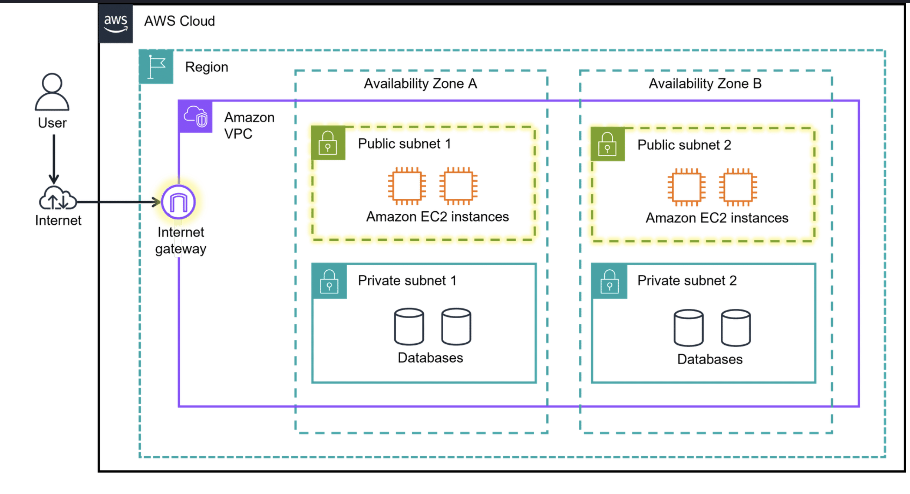
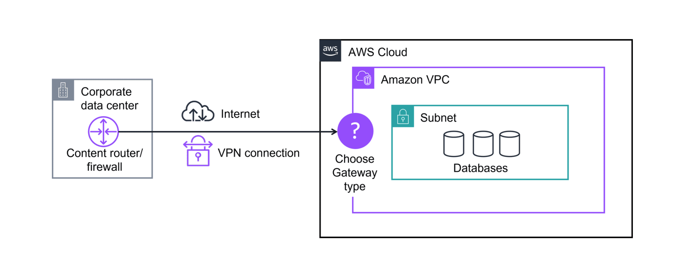
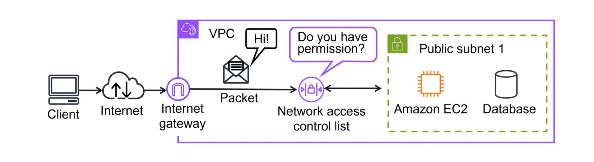
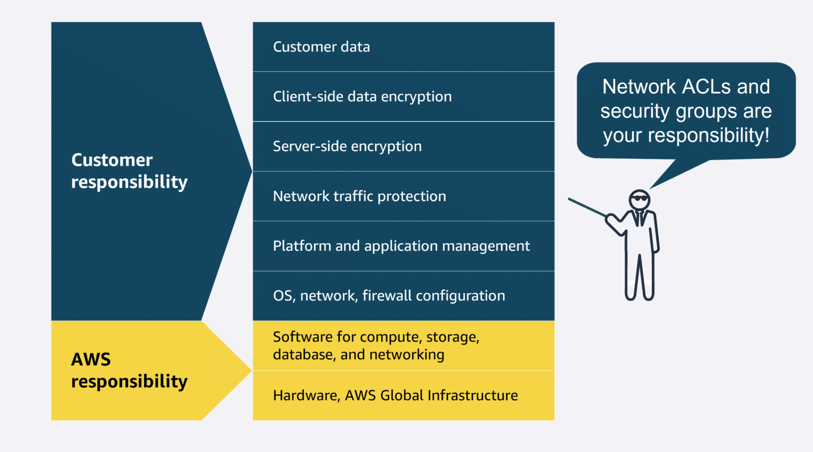

# Module 5: Networking

- Networking in the AWS Cloud consists of the infrastructure and services working together to host your applications, data, and any other resources you might need.

### Networking components

1. **Amazon VPC (Virtual Private Cloud)**

    - A logically isolated virtual network in AWS.
    - Lets you launch AWS resources in a secure environment.
    - You define and control the network configuration.
    - Provides network isolation and security.
    - Benefits of using a VPC:
        - Improves security by controlling and monitoring traffic.
        - Lets you restrict access to instances and services.
        - Gives full control over resource placement, connectivity, and security.
        - Reduces the effort of managing a virtual network compared with on-premises systems.

2. **Subnets**

    - Subnets are used to organize resources, share resources publicly, or isolate resources to keep them private.
    - A subnet is a range of IP addresses within a VPC, Used to divide a VPC into smaller, manageable sections.
    - Helps organize resources and control access.
    - Two types of subnets:
        - Public Subnet
            - A public subnet is commonly used for resources like a customer-facing website.
            - Represented by dashed boxes in diagrams.
        - Private Subnet
            - A private subnet is commonly used to contain resources like a database storing customer or transactional information.
            - Represented by solid boxes in diagrams.

#### AWS Network Diagram

    1. AWS Cloud
        - Outermost layer in architecture diagrams.
        - Contains all AWS infrastructure.
        
    2. Region
        - A separate geographic area.
        - Choose based on:
            1. Low latency
            2. Compliance requirements
            3. Data residency
            4. Service availability
            5. Cost

    3. Amazon VPC
        - Logically isolated network inside a Region.
        - Controls networking and security for AWS resources.

    4. Availability Zone (AZ)
        - One or more physically separate data centers.
        - Each AZ has:
            1. Redundant power
            2. Networking
            3. Connectivity
        - Deploying across multiple AZs improves high availability and fault tolerance.

    5. Subnets
        - Segments inside a VPC.
        - Organize resources based on accessibility and security.
        - Can be Public or Private.

---

## Organizing AWS Cloud Resources

- **Why boundaries matter**
    - AWS has millions of customers and resources, so networking boundaries are essential.
    - Without limits, traffic could move freely between resources.
    - AWS helps you group resources, isolate them, and control who can access them.

1. **Internet gateway**
    - An internet gateway connects a VPC to the internet.
    - It allows public traffic to reach resources in the VPC.
    - Without it, resources in the VPC cannot be accessed from the internet.

    `AWS Cloud → Region → VPC → Availability Zone → Subnet → Resources`

2. **Virtual private gateway**
    - A virtual private gateway allows secure communication between a VPC and a private network.
    - It is used to create a VPN connection over the internet.
    - Traffic is encrypted and protected while travelling through public infrastructure.
    - It allows only approved networks to access the VPC.

### Additional gateway services

- **AWS Transit Gateway**
    - Connects multiple VPCs and on-premises networks through a central hub.

- **NAT Gateway**
    - Allows instances in private subnets to access the internet while blocking inbound connections.

- **Amazon API Gateway**
    - Creates, publishes, manages, and secures APIs at scale.

- **Amazon Virtual Private Cloud**
    - Amazon VPC is used to establish boundaries around your AWS resources.

- **Virtual private gateway**
    - A virtual private gateway allows protected internet traffic to enter into the VPC.

- **Virtual private network** 
    - A VPN encrypts your internet traffic, helping protect it from anyone who might try to intercept or monitor it.

--

## Connecting to the AWS Cloud

- Companies use different connection methods to link on-premises networks, branch offices, data centers, remote workers, and AWS resources.
- The four main options covered in this section are:
  - AWS Client VPN
  - AWS Site-to-Site VPN
  - AWS PrivateLink
  - AWS Direct Connect

1. **AWS Client VPN**
    - Used to securely connect remote workers and on-premises networks to AWS.
    - A fully managed and elastic VPN service.
    - Automatically scales up or down based on demand.
    - No need to manage hardware or estimate user capacity in advance.
    - Benefits:
        - Advanced authentication
        - Secure remote access
        - Easy scaling for remote workers
        - Best for: connecting a remote workforce to AWS resources.

2. **AWS Site-to-Site VPN**
    - Creates a secure, encrypted connection between on-premises networks and resources in an Amazon VPC.
    - Commonly used for data centers, branch offices, and remote locations.
    - Benefits:
        - High availability
        - Secure and private communication
        - Useful for application migration and inter-site connectivity

3. **AWS PrivateLink**
    - Privately connects a VPC to services and resources as though they were inside the VPC.
    - Does not require an internet gateway, NAT device, public IP, or Site-to-Site VPN.
    - Helps keep traffic private and simplifies access to services and endpoints.
    - Best for: private communication to AWS services, other VPCs, and supported endpoints.

4. **AWS Direct Connect**
    - Establishes a dedicated private connection between your network and AWS.
    - Bypasses the public internet, which improves performance and consistency.
    - Useful for:
        - Latency-sensitive applications
        - Large-scale data migration or transfer
        - Hybrid cloud architectures
    - Benefits:
        - Lower latency
        - Higher bandwidth
        - Reduced network costs compared with internet-based transfer

### Summery

- **AWS Direct Connect**: private, dedicated connection to a data center or office.
- **AWS Client VPN**: secure remote access for workers.
- **AWS Site-to-Site VPN**: encrypted connection between sites and AWS VPCs.
- **AWS PrivateLink**: private connection to services and resources from a VPC.

---

## Subnets, Security Groups, and Network Access Control Lists

1. **Subnets**
    - A subnet is a section of a VPC where you group resources based on security or operational needs.
    - **Public subnets** contain resources that must be accessible to the public, such as a website.
    - **Private subnets** contain resources that should be reachable only through a private network, such as databases with sensitive data.
    - You can define rules to allow communication between resources in different subnets.

2. **Network traffic in a VPC**
    - Data moves through a network in packets.
    - When a request reaches a VPC, it passes through network checks before entering or leaving a subnet.
    - Network ACLs evaluate packets at the subnet boundary.

3. **Network ACLs (Network Access Control List)**
    - A network ACL is a virtual firewall that controls inbound and outbound traffic at the subnet level.
    - Every AWS account has a default network ACL.
    - By default, the default network ACL allows all inbound and outbound traffic.
    - Custom network ACLs deny all inbound and outbound traffic until rules are added.
    - Network ACLs include an explicit deny rule for traffic that does not match any allowed rule.
    - They are stateless, which means they check each packet separately for inbound and outbound traffic.

4. **Security groups**
    - A security group is a virtual firewall that controls inbound and outbound traffic for specific resources, such as Amazon EC2 instances.
    - By default, a security group denies all inbound traffic and allows all outbound traffic.
    - You can add custom rules to allow only the traffic you want.
    - Security groups are stateful, so they remember previous decisions and allow return traffic automatically.
    - Multiple instances can use the same security group or different ones.

### Security groups vs. network ACLs

| Feature | Security Groups | Network ACLs |
|---|---|---|
| Scope | Resource level (such as EC2 instances) | Subnet level |
| State | Stateful | Stateless |
| Rule types | Allow rules only | Allow and deny rules |
| Return traffic | Automatically allowed after inbound traffic is allowed | Must be allowed explicitly in both directions |
| Best use | Fine-grained control for individual resources | Broad control for traffic entering and leaving subnets |

### Shared responsibility model
- Securing subnets and resources in a VPC with network ACLs and security groups is your responsibility.
- These components are important defenses for protecting applications in the cloud.

---

## Building an Amazon VPC in the AWS Cloud

- **Steps**
    1. Create the Amazon VPC
    2. Create the subnets
    3. Create an internet gateway and route traffic
    4. Add security controls
    5. Launch resources

---

### Global Networking

- Edge networking brings computing and data closer to users and devices to reduce latency and improve performance.
- It helps deliver faster, more responsive experiences while improving reliability and control over infrastructure.

#### Edge networking services

1. **Amazon Route 53**
    - A highly available and scalable cloud DNS service.
    - Translates domain names into IP addresses so users can reach websites and applications.
    - Routes end users to AWS resources such as Amazon EC2 instances and load balancers.
    - Can also route users to resources outside AWS.
    - Lets you register and manage domain names.

2. **Amazon CloudFront**
    - A content delivery network (CDN) that delivers content with low latency and high speeds.
    - CloudFront is a service that uses the AWS global network to improve application availability, performance, and security.
    - Stores copies of content at edge locations closer to users around the world.
    - Improves loading times, reliability, and cost efficiency for websites, images, videos, and apps.
    - Common use cases include:
        - Streaming video
        - E-commerce websites
        - Mobile applications

3. **AWS Global Accelerator**
    - Uses the AWS global network to improve application availability, performance, and security.
    - Directs traffic through AWS's private global network for faster and more reliable access.
    - Helps reduce latency and improves failover for global applications.

#### Summary
- **Route 53** = DNS and domain routing
- **CloudFront** = content delivery at edge locations
- **Global Accelerator** = optimized global traffic routing for applications

---

## Global Architectures

1. Virtual Private Network (VPN)
    - Secure
    - Flexible
    - Remote access
    - Small-scale
    - Dedicated isn't necessary

2. AWS Direct Connect
    - High bandwidth
    - Low latency
    - Consistent performance
    - Large data transfers
    - Critical applications

1. **AWS Direct Connect**

    - Here is the video example of a company with clients and servers that demand high bandwidth connections for large data transfers and critical application performance. They chose to access their AWS resources securely with multiple Direct Connect connections for failover.

    - Some companies need secure, high-performance connections for large data transfers and critical applications.
    - In this example, the company uses AWS Direct Connect instead of relying only on the public internet.
    - They set up multiple Direct Connect connections for:
        - Fault tolerance and failover
        - Higher aggregate bandwidth
        - More reliable access to AWS resources

    - Key components
        - **Customer network**: Clients and servers require a secure, high-bandwidth connection.
        - **Content router or firewall**: Connects the customer network to Direct Connect.
        - **Multiple Direct Connect connections**: Improve resilience and increase available bandwidth.
        - **Virtual private gateway**: Allows secure access to private resources in an Amazon VPC.

2. **Delivering content globally with low latency**

    - A company with users worldwide can serve content efficiently by using multiple Regions.
    - The request flow is:
        1. Users access the website using a custom domain.
        2. Route 53 resolves the domain and sends the request to the nearest suitable Region.
        3. Route 53 routes traffic to the correct CloudFront edge location.
        4. CloudFront delivers content from the nearest edge location.
        5. The content is fetched from the appropriate origin server in the selected Region.
 
#### Note
- The architecture uses multiple Availability Zones in each Region to improve high availability.

### Summary
- **AWS Direct Connect** is used for dedicated, high-bandwidth, secure hybrid connectivity.
- **Route 53 + CloudFront** help deliver content globally with low latency and better user experience.

---