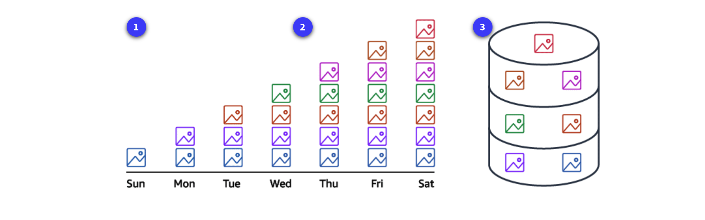
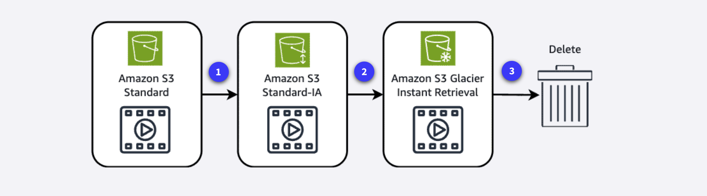

# Module 6: Storage

- AWS provides many solutions for storing, accessing, managing, and backing up your data in the cloud. These virtual storage systems eliminate the need for physical hardware in your data center while offering the flexibility to scale as your needs change.
- AWS offers three distinct types of cloud storage to meet diverse requirements and application needs:
  1. block storage
  2. object storage
  3. file storage

1. **Block storage**

- Block storage provides persistent, low-latency block-level storage volumes that attach to EC2 instances like physical hard drives.
- Volumes can be encrypted, backed up via snapshots, and modified while in use without disrupting the instance.
- AWS block storage services include:
  1. **Amazon EC2 instance store**
  - Unmanaged, non-persistent, high-performance block storage directly attached to EC2 instances.
  - Best for temporary data that does not need to persist after instance termination.
  2. **Amazon Elastic Block Store (EBS)**
  - Managed, persistent block storage volumes for EC2 instances.
  - Offers different volume types for varying workload performance and cost needs.

2. **Object storage**

- Object storage manages data as objects in a flat address space.
- It provides unlimited scalability so you can store vast amounts of unstructured data without worrying about capacity constraints.
- Object storage offers rich metadata capabilities for better data management, search, and analytics across large datasets.
- Primary AWS object storage service:
  - **Amazon Simple Storage Service (S3)**: Fully managed, scalable object storage for storing and retrieving any amount of data from anywhere.

3. **File storage**

- AWS file storage services provide shared file systems accessible over networks, allowing multiple users and applications to access the same data simultaneously.
- They offer scalability and flexibility so capacity can expand without managing physical infrastructure.
- AWS file storage services include:
  1. **Amazon Elastic File System (EFS)**
  - Fully managed, scalable NFS file system for AWS Cloud services and on-premises resources.
  2. **Amazon FSx**
  - Fully managed file storage for popular file systems such as Windows, Lustre, and NetApp ONTAP.

### Additional storage services

- These AWS storage services do not fit neatly into the block, object, or file categories but are important to know:
  1. **AWS Storage Gateway**
  - Fully managed hybrid-cloud storage service providing on-premises access to virtually unlimited cloud storage.
  2. **AWS Elastic Disaster Recovery**
  - Fully managed service that streamlines recovery of physical, virtual, and cloud-based servers into AWS.

### AWS shared responsibility for storage

- AWS storage services are grouped into three categories based on who owns administrative tasks:
  - Fully managed
  - Managed
  - Unmanaged

1. **Fully managed services**

- AWS is responsible for hardware, infrastructure, durability, availability, encryption at rest, and replication.
- Customers are responsible only for data management, access controls, and proper configuration.
- Customer responsibility is lower than with managed services.

2. **Managed services**

- AWS handles underlying storage infrastructure, hardware redundancy, and volume replication.
- Customers are responsible for data backup strategies, encryption configuration, performance optimization, and capacity planning.
- Customer responsibility increases compared to fully managed services.

3. **Unmanaged services**

- Customers take full responsibility for data management, backup/recovery, encryption, performance optimization, and durability.
- AWS maintains only the physical hardware and network infrastructure.
- Unmanaged services place the greatest responsibility on the customer.

---

## EC2 Instance Store and Amazon Elastic Block Store (Amazon EBS)

### Amazon EC2 instance store

- Amazon EC2 instance store is not a stand-alone AWS block storage service. Instead, it refers to the block-level storage that is physically attached to the EC2 instance host computer. Depending on the instance type, EC2 instance store may come attached as the default storage.
- EC2 instance store is directly attached to the host, offering extremely low latency and high I/O performance for applications that need temporary storage with fast access.
- Because the data is lost when an instance is stopped or terminated, EC2 instance store is best for temporary, memory-based storage needs such as buffers, caches, and scratch data. It is not recommended for applications that require data retention.

- **Key takeaway**: no data persistence
  - An Amazon EC2 instance store provides temporary block-level storage for an Amazon EC2 instance. If you stop or terminate the instance, all data written to the attached instance store is deleted.

#### How data is handled

1. **Step 1**: An EC2 instance is running with data stored in an EC2 instance store.
2. **Step 2**: The EC2 instance is stopped.
3. **Step 3**: After the EC2 instance is stopped or terminated, all data in the EC2 instance store is lost.

#### Benefits Of EC2 Instance Storage

1. **Automatically available storage**
   - Instance store volumes are automatically attached to many EC2 instance types, providing temporary block-level storage at no additional cost. Because the storage is physically connected to the host computer, it offers high I/O performance for data that disappears when the instance stops.

2. **Cost effective**
   - Because EC2 instance store is included in the EC2 instance price, you do not pay an additional storage fee. It is ideal for temporary storage needs such as buffers, caches, or scratch data, which can reduce costs for applications that do not require persistent storage.

3. **High performance**
   - EC2 instance store offers extremely low-latency storage directly attached to the host server of your EC2 instance. This proximity provides excellent I/O performance, making it ideal for temporary data that requires fast processing.

---

### Amazon Elastic Block Store (EBS)

- Amazon EBS provides persistent block-level storage volumes for use with Amazon EC2 instances. EBS volumes act like external hard drives and provide consistent, low-latency performance for workloads such as databases and file systems.
- EBS volumes have a lifecycle that is independent from EC2 instances. They can be detached from one instance and attached to another, and the data remains intact even if the instance is shut down or terminated.
- EBS volumes can be backed up, resized, and attached to different EC2 instances.
- To create an EBS volume, you define its size and type. After the volume is created, it can be attached to an Amazon EC2 instance. Because EBS volumes are intended for data that must persist, it is important to back up the data.
- Amazon EBS ensures data protection through automatic replication within the same Availability Zone.
- **It is recommended to take incremental backups by creating Amazon EBS snapshots**.

- **Key takeaway**: **data persistence** - Amazon EBS provides block-level storage volumes that you can use with Amazon EC2 instances. If you stop or terminate an Amazon EC2 instance, the data on the attached EBS volume remains available.

- **Use cases Of EBS** : Some common use cases for Amazon EBS include database hosting, backup storage for applications, and rapid deployment of development environments using volume snapshots.

#### How data is handled

1. **Step 1**: An EC2 instance is running with data stored in an attached EBS volume.
2. **Step 2**: The EC2 instance is stopped.
3. **Step 3**: After the EC2 instance is stopped or terminated, all data stored in the EBS volume is retained.

#### Benefits Of EBS

1. **Data portability**
   - EBS volumes can be detached and reattached to instances as needed, making it easier to manage workloads and move data between instances.

2. **Data migration**
   - EBS volumes can be migrated between Availability Zones using snapshots. Snapshots provide a simple way to move data across regions or create copies.

3. **Instance type changes**
   - Because EBS volumes remain independent of EC2 instances, they can be attached to different instance types. This flexibility allows you to upgrade or downgrade instances without losing data.

4. **Disaster recovery**
   - EBS snapshots provide reliable backup solutions that can be restored in different regions during emergencies. Regular automated snapshots help protect your data and support fast recovery.

5. **Cost optimization**
   - EBS volumes can be modified to different types and sizes to match actual usage patterns. You can switch between storage types or adjust capacity without downtime.

6. **Performance tuning**
   - Amazon EBS offers various volume types to match different workload requirements and IOPS needs. You can adjust volume performance characteristics as application demands change.

---

## Amazon Elastic Block Store (Amazon EBS) Data Lifecycle

### EBS snapshots

- EBS snapshots are point-in-time backups of an EBS volume.
- They are used for disaster recovery, data migration, volume resizing, and creating consistent backups of production workloads.
- EBS snapshots are incremental, so they only save the blocks that changed since the most recent snapshot.
- Snapshots can be used to create multiple new volumes, and those new volumes are exact copies of the original volume at the time the snapshot was taken.
- EBS snapshots are stored redundantly across multiple Availability Zones using Amazon S3.

#### Working with EBS snapshots

- As the customer, you are responsible for scheduling and managing regular EBS snapshots as part of your backup strategy.
- This includes monitoring snapshot costs, deleting unnecessary snapshots, ensuring sensitive data is encrypted, verifying snapshot integrity, and testing restoration procedures regularly.

### EBS Snapshot lifecycle

1. **Initial snapshot**
   - The first snapshot creates a full copy of all data on the volume at that point in time.
   - It acts as the baseline and includes all data blocks in use on the volume.

2. **Subsequent incremental snapshots**
   - After the initial snapshot, only the blocks that changed since the last snapshot are captured.
   - These are called incremental snapshots and are smaller and faster to create than full snapshots.
   - Each incremental snapshot references earlier snapshots, enabling point-in-time recovery.

3. **Snapshot consolidation and management**
   - Even though snapshots are incremental, each one appears as a full point-in-time copy of the volume.
   - The relationship between snapshots is managed automatically.
   - When you delete one snapshot, only the data unique to that snapshot is removed; data referenced by other snapshots is preserved.

#### Benefits of EBS snapshots

1. **Data protection and recovery**
   - Snapshots enable fast recovery from corruption, accidental deletion, or system failures through point-in-time backups.

2. **Operational flexibility**
   - Snapshots support cross-Region data migration, volume resizing, volume cloning, and sharing data across AWS accounts.

3. **Cost effectiveness**
   - Snapshots use incremental backup technology, storing only changed blocks after the initial backup, which reduces storage costs and backup time.

#### Amazon Data Lifecycle Manager

- You can automate the creation, retention, and deletion of EBS snapshots using Amazon Data Lifecycle Manager.
- It can schedule snapshots during off-peak hours to minimize performance impact and automatically delete outdated backups to control storage costs.
- It is especially useful for large-scale deployments where manual snapshot management would be time-consuming and error-prone.

#### Amazon Data Lifecycle Manager workflow

- By reducing manual effort and establishing consistent backup policies, Data Lifecycle Manager helps maintain compliance requirements by scheduling regular backups and enforcing retention rules.
  1. **Create an EBS snapshots policy**
     - Create a policy using the Amazon EC2 console, API calls, AWS CLI, SDKs, or AWS CloudFormation.

  2. **Select the target resource type**
     - Choose either an EBS volume or an EC2 instance as the target for the snapshot.

  3. **Exclude volumes**
     - Narrow down the scope by excluding the root volume or data volumes.

  4. **Set custom schedules**
     - Automate the creation, retention, and deletion of EBS snapshots with custom schedules.

  5. **Apply additional actions**
     - Before finalizing the policy, you can configure tags, snapshot archiving, Amazon EBS fast snapshot restore, cross-Region copying, and cross-account sharing.

---

## Amazon Simple Storage Service (Amazon S3)

- Amazon S3 is a fully managed object storage service.
- It stores data as **objects** inside **buckets**.
- It is designed for **99.999999999% (11 9's) durability**.
- It can store virtually unlimited amounts of data.
- Maximum object size is **5 TB**.
- Buckets are created in a specific **AWS Region** and have **globally unique names**.

- **Key takeaway**: Amazon S3 is ideal for storing large amounts of unstructured data such as images, videos, backups, logs, and static website content.

#### Core concepts

1. **Objects**
   - An object is the fundamental unit of storage in Amazon S3.
   - Each object consists of:
     - the data itself
     - metadata
     - a unique key
   - An object can also have features such as version IDs, tags, and access control settings.
   - Individual objects can be as large as **5 TB**.

2. **Buckets**
   - A bucket is a container for objects.
   - Buckets help organize data and are the main unit for applying policies, permissions, versioning, and logging.
   - A bucket belongs to one Region, but its name must be unique across all AWS accounts globally.
   - Buckets can contain a virtually unlimited number of objects.

#### Important S3 features

1. **Versioning**
   - Versioning allows you to keep multiple versions of the same object.
   - It helps protect against accidental deletion or overwrites.

2. **Storage classes**
   - Amazon S3 offers multiple storage classes to balance cost and access needs.
   - Common examples include S3 Standard, S3 Standard-IA, and S3 Glacier storage classes.

3. **Lifecycle management**
   - Lifecycle rules can automatically transition objects to cheaper storage classes or delete them after a set period.
   - This helps reduce storage costs over time.

4. **Static website hosting**
   - Amazon S3 can host static websites made of HTML, CSS, JavaScript, images, and other static files.

#### Benefits of Amazon S3

1. **Virtually unlimited scalability**
   - Amazon S3 automatically scales to store any amount of data.

2. **High durability**
   - Data is designed to be stored durably across multiple facilities within an AWS Region.

3. **Cost optimization**
   - You pay only for what you store and use, and lifecycle policies can lower costs further.

4. **Broad use cases**
   - Common use cases include backups, archives, media storage, log storage, data lakes, disaster recovery, and static website hosting.

### Amazon S3 security

- By default, Amazon S3 buckets and objects are **private**.
- Access must be explicitly granted.

1. **Bucket policies**
   - Bucket policies are resource-based policies attached directly to buckets.
   - They define which principals can access the bucket and what actions they can perform.

2. **Identity-based policies**
   - IAM users, groups, and roles can be granted permissions to S3 resources through identity-based policies.

3. **Presigned URLs**
   - Presigned URLs allow temporary access to a specific S3 object without making the bucket public.

4. **S3 Access Points**
   - S3 Access Points provide dedicated access endpoints with their own access policies for specific applications or teams.

5. **Encryption**
   - Encryption at rest protects stored data.
   - Encryption in transit protects data moving between clients and Amazon S3.

6. **Audit logs**
   - Access to Amazon S3 can be monitored using logging and auditing services such as AWS CloudTrail.

### Common exam reminders

- Amazon S3 is **object storage**, not block storage or file storage.
- Amazon S3 is designed for scalable object storage that can efficiently store and serve various content types (Unstructured Data).
- Amazon S3 is a **regional** service.
- Individual objects can be as large as **5 TB**.
- Buckets can contain a virtually unlimited number of objects.
- S3 Block Public Access settings override bucket policies, preventing public access even when policies allow it.

---

## Amazon S3 Storage Classes and S3 Lifecycle

- Amazon S3 offers multiple storage classes to match different access patterns, resiliency needs, performance requirements, and cost goals.
- Choosing the right storage class helps optimize storage cost while keeping the right retrieval speed for your workload.

- **Key takeaway**: frequently accessed data belongs in standard classes, while rarely accessed or archival data belongs in infrequent-access or Glacier classes.

### Common S3 storage classes

1. **S3 Standard**
   - General-purpose storage for frequently accessed data.
   - Common use cases include dynamic websites, content distribution, mobile applications, and analytics workloads.
   - If you do not specify a storage class when uploading an object, it is stored in S3 Standard by default.

2. **S3 Intelligent-Tiering**
   - Best for data with unknown or changing access patterns.
   - Amazon S3 automatically moves objects between access tiers to reduce cost while maintaining performance.

3. **S3 Standard-IA**
   - Designed for data that is accessed infrequently but still needs rapid retrieval when required.
   - Common use cases include long-term backups and disaster recovery files.

4. **S3 One Zone-IA**
   - Stores data in a single Availability Zone.
   - Costs less than S3 Standard-IA, but has lower resiliency.
   - Best for infrequently accessed, re-creatable data such as secondary backups.

5. **S3 Express One Zone**
   - High-performance storage class for latency-sensitive workloads that need very fast access.
   - Stores data in a single Availability Zone.
   - Useful for workloads that require consistent low-latency object access.

6. **S3 Glacier Instant Retrieval**
   - For archival data that is rarely accessed but still needs millisecond retrieval.
   - Good when you want archival pricing with fast access.

7. **S3 Glacier Flexible Retrieval**
   - Low-cost archival storage for data that is accessed rarely, such as once or twice per year.
   - Retrieval times can range from minutes to hours depending on the retrieval option.

8. **S3 Glacier Deep Archive**
   - Lowest-cost S3 storage class for long-term retention and compliance archives.
   - Best for data that is very rarely accessed and can tolerate long retrieval times.

9. **S3 Outposts**
   - Extends S3 object storage to on-premises AWS Outposts environments.
   - Useful when workloads must keep data local because of residency, compliance, or low-latency requirements.

#### Quick way to think about S3 storage classes

- **Frequently accessed**: S3 Standard
- **Unknown or changing access patterns**: S3 Intelligent-Tiering
- **Infrequently accessed but needs fast retrieval**: S3 Standard-IA or S3 One Zone-IA
- **Archive with instant retrieval**: S3 Glacier Instant Retrieval
- **Archive with flexible retrieval times**: S3 Glacier Flexible Retrieval
- **Lowest-cost long-term archive**: S3 Glacier Deep Archive

### S3 Lifecycle

- S3 Lifecycle helps automate object management so you do not have to manually move or delete data.
- Lifecycle rules can apply to individual objects or groups of objects.
- Two main lifecycle actions are:
  - **Transition actions**: move objects to another storage class after a defined period.
  - **Expiration actions**: permanently delete objects after a defined period.

- Lifecycle rules are typically based on **object age**, which makes them useful for automatic cost optimization.

#### Example lifecycle flow

1. **After 30 days**

    - Move an object from S3 Standard to S3 Standard-IA.

2. **After 60 more days**

    - Move the object from S3 Standard-IA to S3 Glacier Instant Retrieval.

3. **After 365 days**

    - Expire the object and permanently delete it.

#### Benefits of S3 Lifecycle

1. **Cost savings**

    - Automatically moves older data to cheaper storage classes.

2. **Less manual work**

    - Reduces the need to manage storage transitions manually.

3. **Better data retention management**

    - Helps enforce deletion schedules for temporary or aging data.

4. **Improved operational consistency**

    - Ensures storage policies are applied consistently across buckets and objects.

### Common exam reminders

- S3 Standard is the default storage class.
- S3 One Zone-IA stores data in only one Availability Zone.
- Glacier classes are for archival workloads.
- S3 Lifecycle can automate both transitions and deletions.
- Intelligent-Tiering is useful when access patterns are unpredictable.
- Amazon S3 Lifecycle is used create rules that automate the transition of objects between storage classes. It can set expiration dates for objects based on defined criteria, optimizing storage costs while maintaining access to data based on its changing value over time.

---

## Amazon Elastic File System (Amazon EFS) - Managed File System

### Quick comparison: EBS vs EFS

- **Amazon EBS**
  - Block storage for EC2 instances
  - Typically attached to one instance at a time at the CCP level
  - Tied to a specific Availability Zone
  - Does not automatically scale storage

- **Amazon EFS**
  - Shared file storage for multiple compute resources
  - Multiple instances can read and write to the same data at the same time
  - Uses the Linux NFS protocol
  - Automatically scales as files are added and removed

### What is Amazon EFS?

- Amazon EFS is a fully managed, serverless, elastic file storage service for AWS cloud services and on-premises resources.
- It supports the **NFSv4** protocol, so Linux-based applications can mount it like a shared network file system.
- It automatically scales to petabytes without disrupting applications.
- It is designed for workloads that need shared access from multiple compute resources such as EC2 instances, containers, or serverless applications.
- Amazon EFS is **not supported on Windows-based EC2 instances**.

- **Key takeaway**: use Amazon EFS when multiple resources need shared, elastic file storage.

#### Amazon EFS benefits

1. **Shared access**

    - Multiple instances can mount and use the same file system at the same time.
    - This makes EFS a strong fit for shared content, web farms, home directories, and distributed applications.

2. **Elastic storage**

    - Amazon EFS grows and shrinks automatically as files are added or removed.
    - You do not need to provision storage capacity in advance.
    - You pay only for the storage you use.

3. **High availability and durability**

    - **Regional** EFS file systems store data redundantly across multiple Availability Zones in the same Region.
    - This helps keep data available even if one Availability Zone becomes unavailable.

4. **Managed service**

    - AWS manages the underlying file storage infrastructure for you.
    - You do not need to deploy, patch, or maintain file servers.

### Amazon EFS file system types and storage classes

- Amazon EFS has both **file system types** and **storage classes**.
- This distinction matters:
  - **File system types** define availability and resiliency.
  - **Storage classes** define access pattern, performance, and cost.

#### EFS file system types

1. **Regional**

    - Recommended option for most workloads.
    - Stores data redundantly across multiple Availability Zones in the same Region.
    - Best for data that needs the highest availability and resilience.

2. **One Zone**

    - Stores data in a single Availability Zone.
    - Lower cost than Regional EFS, but less resilient.
    - Best for workloads that can tolerate reduced availability or where data can be recreated.

#### EFS storage classes

1. **EFS Standard**

    - For active data that needs the lowest latency.
    - New data is written here first.

2. **EFS Infrequent Access (IA)**

    - Cost-optimized for data accessed only a few times each quarter.
    - Good for less frequently used files.

3. **EFS Archive**

    - Lowest-cost EFS storage class for data accessed only a few times each year or less.
    - Best for cold file data that does not need the lowest latency.

### Amazon EFS data lifecycle

- Amazon EFS lifecycle policies can automatically move data between storage classes based on usage patterns.
- Lifecycle policies apply to the **entire file system**.
- This helps reduce storage costs without manual intervention.

1. **Transition to IA**
   - Moves files from Standard to EFS IA after they have not been accessed in the Standard storage class for a set period.
   - By default, files transition to IA after **30 days**.

2. **Transition to Archive**
   - Moves files from Standard or IA into EFS Archive for colder data.
   - By default, files transition to Archive after **90 days** without access in the Standard storage class.

3. **Transition to Standard**
   - Can move files from IA or Archive back to Standard when they are accessed.
   - By default, this setting is **disabled**, so accessed files remain in IA or Archive unless you enable return to Standard on first access.

### Common exam reminders

- Amazon EFS is **file storage**, Amazon EBS is **block storage**, and Amazon S3 is **object storage**.
- Amazon EFS uses the **NFS** protocol and is mainly for **Linux-based** workloads.
- Multiple resources can access the same EFS file system at the same time.
- **Regional** EFS spans multiple Availability Zones; **One Zone** does not.
- EFS can automatically move older data to **IA** or **Archive** using lifecycle policies.
- EFS automatically scales, while EBS capacity is provisioned manually.

---

## Amazon FSx

- Amazon FSx is a **fully managed** service for launching and running popular file systems on AWS.
- It is designed for workloads that need **feature-rich** and **high-performance** file storage.
- AWS handles hardware provisioning, patching, monitoring, and backups.
- Amazon FSx offers four file system families:
  1. **FSx for Windows File Server**
  2. **FSx for NetApp ONTAP**
  3. **FSx for OpenZFS**
  4. **FSx for Lustre**

- **Key takeaway**: use Amazon FSx when your workload needs a specific file system, protocol, or enterprise feature set that Amazon EFS does not provide.

### Amazon EFS vs Amazon FSx

- **Amazon EFS**
  - AWS-native shared file storage
  - Uses NFS
  - Best for simple, elastic Linux file sharing

- **Amazon FSx**
  - Managed file systems based on specific technologies
  - Supports multiple protocols and specialized feature sets
  - Best when you need Windows, Lustre, OpenZFS, or NetApp ONTAP capabilities

### Benefits of Amazon FSx

1. **File system compatibility**

    - Amazon FSx supports widely used file systems and protocols, making it easier to migrate existing applications without major changes.

2. **Managed infrastructure**

    - AWS manages deployment, patching, hardware replacement, and backups.

3. **High performance**

    - Amazon FSx is designed for demanding workloads that need low latency, high throughput, or specialized file system features.

4. **Data protection and availability**

    - Depending on the FSx family, you can use features such as Multi-AZ deployments, backups, snapshots, replication, and encryption.

### Amazon FSx file system families

1. **Amazon FSx for Windows File Server**
   - Fully managed shared storage built on Windows Server.
   - Uses the **SMB(Server Message Block)** protocol and supports native Windows compatibility.
   - Common use cases:
     - Migrate Windows file servers to AWS
     - Accelerate hybrid workloads
     - Reduce SQL Server deployment cost
     - Support virtual desktops and application streaming

2. **Amazon FSx for NetApp ONTAP**
   - Fully managed shared storage built on NetApp ONTAP.
   - Good for customers who want familiar ONTAP features such as snapshots, cloning, replication, and automatic tiering.
   - Supports multi-protocol access for many enterprise workloads.
   - Common use cases:
     - Migrate workloads to AWS
     - Build modern applications
     - Modernize data management
     - Improve business continuity and disaster recovery

3. **Amazon FSx for OpenZFS**
   - Fully managed shared storage built on the OpenZFS file system.
   - Accessible through the **NFS** protocol.
   - Strong fit for **Linux-based** workloads that benefit from low latency, snapshots, and cloning.
   - Common use cases:
     - Migrate Linux workloads to AWS
     - Speed up analytics workloads
     - Accelerate content management
     - Increase dev/test velocity

4. **Amazon FSx for Lustre**
   - Fully managed shared storage built on the Lustre high-performance file system.
   - Best for workloads that need **very fast parallel file storage**.
   - Integrates well with **Amazon S3** for data processing workflows.
   - Common use cases:
     - Accelerate machine learning workloads
     - Support high performance computing
     - Power big data analytics
     - Improve media processing agility

### Common exam reminders

- Amazon FSx is a **Managed file storage** service.
- Choose Amazon FSx when you need a **specific file system technology** rather than general-purpose shared NFS storage.
- For **Windows file shares**, use **FSx for Windows File Server with SMB**.
- For **HPC, ML, and very high-performance parallel storage**, use **FSx for Lustre**.
- For **NetApp features** such as snapshots, replication, and multi-protocol access, use **FSx for NetApp ONTAP**.
- For **OpenZFS-based NFS workloads**, use **FSx for OpenZFS**.

---

## AWS Storage Gateway

- AWS Storage Gateway is a **hybrid cloud storage** service.
- It connects on-premises environments to AWS storage services.
- It gives on-premises applications access to virtually unlimited cloud storage while keeping frequently used data cached locally for lower-latency access.
- You can deploy it as a virtual appliance in VMware, Hyper-V, or Linux KVM, or as an EC2 instance in AWS.

- **Key takeaway**: AWS Storage Gateway helps extend on-premises storage into AWS without forcing you to rewrite existing applications or workflows.

### Benefits of AWS Storage Gateway

1. **Seamless integration**

    - It connects existing on-premises applications to AWS storage using familiar interfaces and protocols.

2. **Local caching**

    - Frequently accessed data can be cached locally for faster access.

3. **Centralized hybrid storage**

    - It simplifies storage management across on-premises infrastructure and AWS.

4. **Cost optimization**

    - It reduces the need for large on-premises storage investments by using AWS for backup, archive, and disaster recovery.

### Main gateway types

1. **Amazon S3 File Gateway**
   - Presents file-based access to data in **Amazon S3**.
   - Supports familiar **NFS** and **SMB** access methods.
   - Files written locally are stored as objects in Amazon S3.
   - Frequently accessed data is cached locally.
   - Common use cases:
     - Hybrid file shares
     - Cloud-backed backups
     - Feeding data lakes in Amazon S3

2. **Volume Gateway**
   - Presents **iSCSI block storage volumes** to on-premises applications.
   - Useful when applications expect block storage rather than file storage.
   - Main modes:
     - **Cached volumes**: primary data is stored in AWS, while frequently accessed data is cached locally.
     - **Stored volumes**: primary data is stored locally, and AWS keeps asynchronous backups as **EBS snapshots**.

3. **Tape Gateway**
   - Replaces physical tape systems with **virtual tapes** in AWS.
   - Works with existing backup software, so backup workflows do not need major changes.
   - Virtual tapes are stored in AWS and can be archived for long-term retention.
   - Common use cases:
     - Backup modernization
     - Long-term archive
     - Disaster recovery

### Additional note

- Current AWS documentation also includes **Amazon FSx File Gateway**.
- It provides on-premises access to **Amazon FSx for Windows File Server** shares.

### Common exam reminders

- AWS Storage Gateway is for **hybrid storage** between on-premises environments and AWS.
- **S3 File Gateway** is for file-based access to **Amazon S3**.
- **Volume Gateway** is for **block storage** access using **iSCSI**.
- **Tape Gateway** is for replacing physical tape backups with virtual tapes in AWS.
- Storage Gateway is useful for backups, archives, disaster recovery, and extending on-premises storage into the cloud.

---

## AWS Elastic Disaster Recovery

- AWS Elastic Disaster Recovery (AWS DRS) minimizes downtime and data loss by replicating source servers to AWS.
- It supports disaster recovery for on-premises and cloud-based applications that run on supported operating systems.
- Replicated data is stored in a low-cost staging area in your AWS account until you need to launch recovery instances.
- You can launch recovery instances within minutes for drills or actual recovery.
- It supports point-in-time recovery and failback after the primary site is restored.

- **Key takeaway**: AWS Elastic Disaster Recovery is for recovering servers and applications quickly after an outage without maintaining a full secondary data center.

### Benefits of AWS Elastic Disaster Recovery

1. **Business resilience**
   - Helps keep critical applications recoverable with continuous replication and fast recovery.

2. **Non-disruptive testing**
   - You can run disaster recovery drills without interrupting production systems.

3. **Cost optimization**
   - Uses affordable storage and minimal compute during normal operation, which reduces the cost of standby infrastructure.

4. **Streamlined recovery**
   - Recovery settings, replication, drills, and failback can be managed from the AWS console.

### Typical use cases

1. **Healthcare data protection**
   - Protect patient record systems and keep critical healthcare applications recoverable during outages.

2. **Financial services continuity**
   - Replicate core banking or transaction systems so they can be recovered quickly if the primary environment fails.

3. **Manufacturing operations recovery**
   - Protect factory planning and supply chain systems to reduce disruption during disasters.

### Common exam reminders

- AWS Elastic Disaster Recovery is a **disaster recovery** service, not a primary storage service.
- It is designed to reduce **downtime** and **data loss**.
- It supports **drills**, **point-in-time recovery**, and **failback**.
- It helps replace the need for a costly secondary disaster recovery site.

---

## AWS Storage Services - Real-Life Use Cases

### Amazon S3 example

- **Scenario**: a coffee shop hosts a static website using Amazon S3 static website hosting.
- **Why S3 fits**:
  - Static website files are stored as objects.
  - Amazon S3 scales automatically for traffic spikes.
  - There is no server management.
  - It is cost-effective for static content such as HTML, CSS, JavaScript, images, and videos.

### Amazon EBS example

- **Scenario**: a fitness center's booking application runs on EC2 and the database becomes a performance bottleneck.
- **Why EBS fits**:
  - Amazon EBS provides block storage for EC2 instances.
  - It offers low latency and strong read/write performance.
  - A **Provisioned IOPS SSD** volume type is a good fit for mission-critical databases.
- **Why not S3**:
  - Amazon S3 is object storage.
  - It is not designed for block-level database transactions or frequent low-latency updates.

### Amazon EFS example

- **Scenario**: an automotive repair business needs shared access to images, videos, diagrams, and repair procedures.
- **Why EFS fits**:
  - Multiple EC2 instances and users can access the same files at the same time.
  - Amazon EFS automatically scales as the dataset grows.
  - It is well suited for collaborative applications that need shared file storage.

### Quick comparison: S3 vs EBS vs EFS

| Feature                          | Amazon S3                    | Amazon EBS             | Amazon EFS          |
| -------------------------------- | ---------------------------- | ---------------------- | ------------------- |
| Storage type                     | Object                       | Block                  | File                |
| Data access                      | Objects                      | Blocks                 | Files               |
| Attach to EC2                    | No                           | Yes                    | Yes                 |
| Shared by multiple EC2 instances | No                           | No                     | Yes                 |
| Automatic scaling                | Yes                          | No                     | Yes                 |
| Best for                         | Static files, backups, media | EC2 storage, databases | Shared file storage |
| Static website hosting           | Yes                          | No                     | No                  |

### Which service should you choose?

| Requirement                                | AWS service                          |
| ------------------------------------------ | ------------------------------------ |
| Static website hosting                     | Amazon S3                            |
| Images, videos, and backups                | Amazon S3                            |
| Storage for an EC2 instance                | Amazon EBS                           |
| Relational database storage                | Amazon EBS                           |
| High-performance database storage          | Amazon EBS with Provisioned IOPS SSD |
| Shared file system                         | Amazon EFS                           |
| Multiple EC2 instances need the same files | Amazon EFS                           |
| Collaborative applications                 | Amazon EFS                           |

### AWS exam memory trick

- **Amazon S3**: think **objects** and static content.
- **Amazon EBS**: think **EC2 disk** and block storage.
- **Amazon EFS**: think **everyone shares files**.

---
