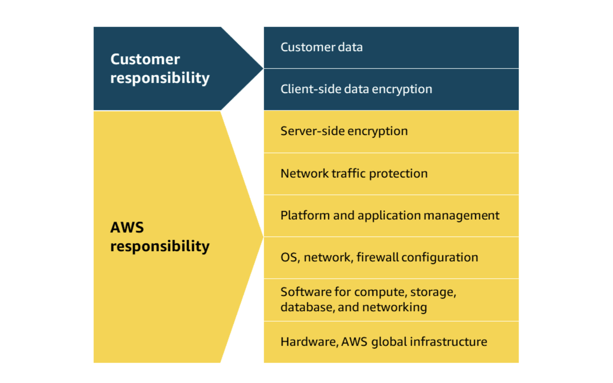
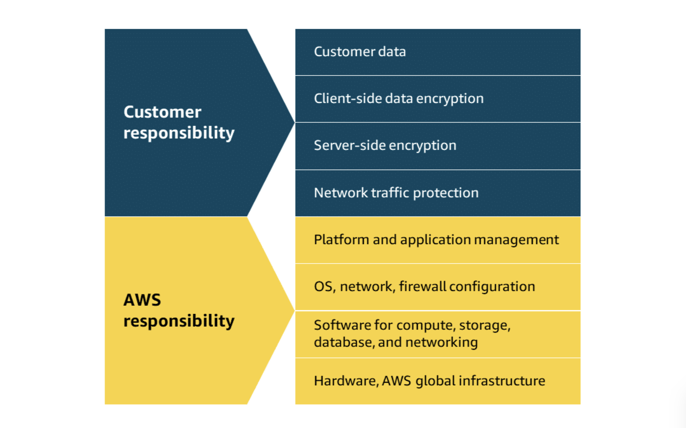
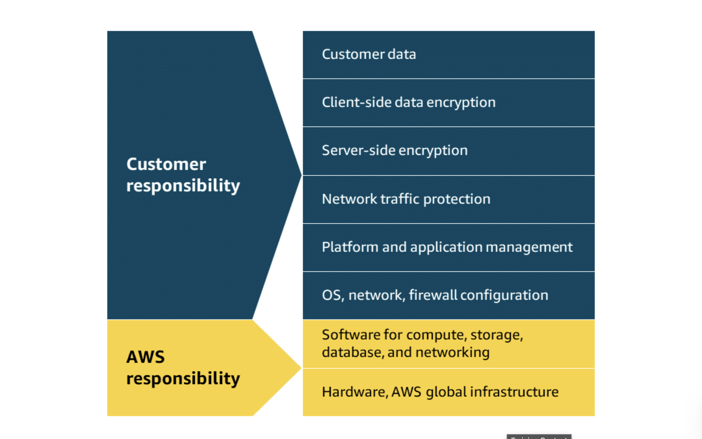
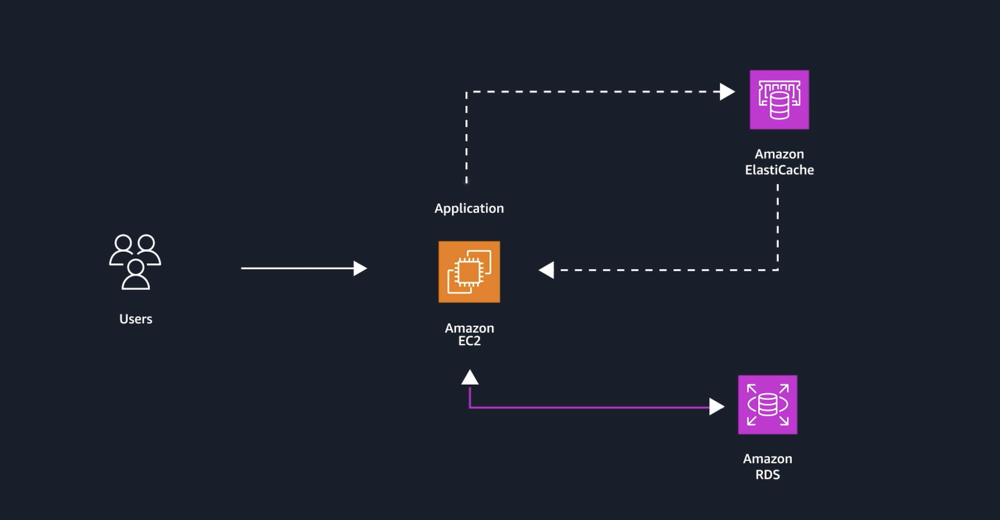

# Module 7: Databases

## Introduction to Databases

- AWS offers a wide range of database services for different application and data needs.
- These services are designed to be scalable, reliable, and easier to operate than traditional self-managed databases.
- AWS database offerings include:
  - relational databases
  - nonrelational databases
  - in-memory databases and caches
  - purpose-built databases for specialized use cases

- **Key takeaway**: AWS provides different database services because different workloads need different data models, performance profiles, and management levels.

---

## AWS Shared Responsibility for Databases

- AWS database services can be grouped by who is responsible for operational tasks.
- These categories are:
  1. fully managed
  2. managed
  3. unmanaged
- Most of the database services in this module are fully managed, with a few managed services and no core focus on unmanaged options.

1. **Fully managed services**
    - In fully managed database services, AWS handles most operational work.
    - AWS responsibilities typically include:
        - provisioning
        - scaling
        - patching
        - backups
        - routine maintenance
        - monitoring and metrics
        - much of the underlying availability and infrastructure management
    - Customer responsibilities mainly include:
        - designing the data model
        - managing access controls
        - using the service correctly for the workload

    

2. **Managed services**
    - In managed database services, AWS handles the underlying infrastructure and many routine tasks.
    - AWS responsibilities typically include:
        - hardware provisioning
        - automated backups
        - patching support
        - infrastructure maintenance
    - Customer responsibilities typically include:
        - database engine configuration
        - query optimization
        - schema design
        - performance tuning decisions

    

3. **Unmanaged services**
    - In unmanaged database deployments, the customer is responsible for nearly everything.
    - Customer responsibilities include:
        - installation
        - configuration
        - patching
        - maintenance
        - database security
        - backups
        - high availability setup
        - performance optimization
    - A common example is running a database such as MySQL directly on an **Amazon EC2** instance.

    

---

## Relational Database Services

- Relational databases store structured data in tables made up of rows and columns.
- They use **SQL (Structured Query Language)** to create, manage, and query data.
- They are a good fit for applications that need:
  - structured data
  - consistent schemas
  - relationships between records
  - transactions and complex queries

- **Key takeaway**: relational databases are best when your data is structured and different pieces of data need to relate to each other reliably.

#### Simple relational database example

- A restaurant inventory database might store each product as one record.

| ID | Product Name | Size | Price |
| --- | --- | --- | --- |
| 1 | Medium roast ground coffee | 12 oz. | $13.95 |
| 2 | Single-origin whole bean coffee | 12 oz. | $21.95 |

---

## Amazon Relational Database Service (Amazon RDS)

- Amazon RDS is a **fully managed** relational database service that makes it easier to set up, operate, and scale relational databases in AWS.
- It handles many routine administrative tasks such as:
    - Automated patching
    - Backups
    - Redundancy
    - Failover
    - Disaster recovery
- Amazon RDS uses DB instance classes that can be optimized for general-purpose, memory-optimized, compute-optimized, or burstable workloads.
- Aurora provides comparable performance to high-end commercial databases but at one-tenth the cost, which makes it ideal for organizations looking to reduce database costs without sacrificing performance.

### Supported Amazon RDS database engines

- Amazon RDS supports these database engines:
  - MySQL
  - PostgreSQL
  - MariaDB
  - Microsoft SQL Server
  - Oracle Database
  - IBM Db2
- **Amazon Aurora** is also part of the Amazon RDS family, but it is usually studied as its own AWS-built relational engine.

### Key Amazon RDS features

1. **Automated backups and snapshots**
    - Amazon RDS can create automated backups for point-in-time recovery.
    - You can also create manual **DB snapshots** when you want a user-initiated backup.

2. **Multi-AZ deployments**
    - Amazon RDS can maintain a synchronous standby instance in another Availability Zone.
    - If the primary instance fails, Amazon RDS can automatically fail over to the standby instance.

3. **Read replicas**
    - Read replicas can help scale read-heavy workloads by offloading read traffic from the primary database.

4. **Security**
    - Amazon RDS supports VPC isolation, encryption at rest, and encryption in transit.

5. **Scalability**
    - You can scale compute and storage based on workload needs.

### Common use cases for Amazon RDS

- Web applications
- Enterprise applications
- E-commerce product catalogs and inventories
- Traditional relational workloads that need managed operations

### Benefits of Amazon RDS

1. **Reduced operational overhead**
   - AWS handles many repetitive administrative tasks so you can focus more on the application and schema design.

2. **High availability**
   - Multi-AZ deployments improve resilience and minimize downtime.

3. **Performance support**
   - Features such as read replicas and Performance Insights help with monitoring and read scaling.

4. **Cost optimization**
   - You avoid the upfront cost of buying and maintaining your own database hardware.

---

## Amazon Aurora

- Amazon Aurora is a **fully managed relational database engine** in the Amazon RDS family.
- It is compatible with **MySQL** and **PostgreSQL**.
- Aurora is designed for high performance, high availability, and automatic scaling.
- It uses distributed storage that grows automatically as needed.

- **Key takeaway**: choose Aurora when you want a cloud-native relational database with MySQL or PostgreSQL compatibility and stronger performance and availability than standard deployments.

### Key Amazon Aurora features

1. **High performance**
   - Aurora is designed to deliver up to **6x** the throughput of stock MySQL and up to **6x** the throughput of stock PostgreSQL on similar hardware.

2. **Automatic storage scaling**
   - Aurora storage grows automatically as your data grows.
   - An Aurora cluster volume can grow up to **256 TiB**.

3. **High availability and durability**
   - Aurora replicates data across **three Availability Zones** with **six copies of data**.
   - It is designed for strong fault tolerance and fast failover.

4. **Automated backups**
   - Aurora continuously backs up data and supports point-in-time recovery.

### Common use cases for Amazon Aurora

- Gaming applications
- Media and content platforms
- SaaS applications
- Enterprise applications
- Real-time or high-throughput relational workloads

### Common exam reminders

- Relational databases use **tables** and **SQL**.
- Amazon RDS is the default managed choice for many traditional relational workloads.
- **Multi-AZ** improves availability and failover readiness.
- **Read replicas** help with read scaling, not primary failover.
- Aurora is **MySQL- and PostgreSQL-compatible** and is designed for higher performance and availability.

---

## NoSQL Database Services

- NoSQL databases are also called **non-relational databases**.
- They do not rely on the same fixed row-and-column relationships used by relational databases.
- A common NoSQL model is the **key-value** model, where each item is identified by a unique key.
- NoSQL databases are a good fit when you need:
  - flexible schemas
  - very high scale
  - low-latency access
  - rapidly changing or non-uniform data

- **Key takeaway**: NoSQL databases trade rigid structure for flexibility and scale.

### Key-value example

- In a key-value design, each item can have different attributes.

| Key | Value |
| --- | --- |
| 1 | Name: John Doe; Address: 123 Any Street; Favorite drink: Medium latte |
| 2 | Name: Mary Major; Address: 100 Main Street; Birthday: July 5, 1994 |

### Amazon DynamoDB

- Amazon DynamoDB is a **serverless, fully managed, distributed NoSQL database**.
- It supports both **key-value** and **document** data models.
- It is designed for applications that need consistent **single-digit millisecond** performance at any scale.
- DynamoDB is well suited for workloads with flexible schemas and rapidly growing traffic.
- It support Auto scaling with provisioned capacity. 
    - Auto scaling with provisioned capacity means that DynamoDB can automatically adjust capacity in response to actual traffic patterns. This keeps application performance consistent during unpredictable peaks in traffic, while optimizing costs during slower periods.

- **Key takeaway**: choose DynamoDB when you need a highly scalable NoSQL database with very low operational overhead.

### Common use cases for DynamoDB

- Gaming platforms
- Financial services applications
- Mobile applications with large or global user bases
- Serverless applications
- High-traffic web and event-driven applications

### Key DynamoDB features

1. **Serverless scaling**
   - DynamoDB can scale without you managing servers.
   - It supports both **on-demand** and **provisioned** capacity modes.

2. **Consistent low-latency performance**
   - DynamoDB is designed to deliver single-digit millisecond performance at any scale.

3. **High availability and resilience**
   - By default, DynamoDB replicates data across **three Availability Zones** within an AWS Region.
   - For **multi-Region** replication, you use **DynamoDB global tables**.

4. **Backup and recovery**
   - DynamoDB supports on-demand backups and point-in-time recovery.

5. **Security**
   - DynamoDB supports IAM-based access control and encryption at rest.
   - Data can be encrypted with AWS owned, AWS managed, or customer managed KMS keys.

### Benefits of DynamoDB

1. **Flexible schema**
   - Items in the same table do not have to contain the same set of attributes.

2. **High performance**
   - DynamoDB is optimized for workloads that need predictable low-latency access.

3. **Massive scalability**
   - It can handle very large tables and rapidly changing request rates.

4. **Low operational overhead**
   - AWS manages the infrastructure, availability, maintenance, and scaling.

### Common exam reminders

- DynamoDB is a **NoSQL** database, not a relational database.
- It supports **key-value** and **document** data models.
- DynamoDB is **serverless** and fully managed.
- By default, it replicates data across **three AZs in one Region**.
- **Global tables** are used for multi-Region replication.

---

## In-Memory Caching Services

- An in-memory cache stores frequently accessed data in **RAM** instead of disk.
- Accessing data from memory is much faster than reading it from traditional disk-based storage.
- Applications check the cache first before going back to the original data source.
- This helps:
  - reduce load on the primary database
  - improve response time
  - support high-throughput applications

- Common cache use cases include:
  - session data
  - API responses
  - database query results
  - leaderboards

- **Key takeaway**: use in-memory caching when you need very fast access to frequently requested data.

### Amazon ElastiCache

- Amazon ElastiCache is a fully managed in-memory caching service.
- It supports **Valkey**, **Redis OSS**, and **Memcached** engines.
- ElastiCache can be used as **serverless caching** or as **node-based clusters**, depending on how much control you need.
- AWS manages tasks such as hardware provisioning, patching, monitoring, and failed node replacement.
- ElastiCache addresses performance bottlenecks by caching frequently accessed data in memory, to reduce the load on primary databases and improve response times.

- **Key takeaway**: ElastiCache helps you add high-speed caching without managing the cache infrastructure yourself.

### Common use cases for ElastiCache

- Session data management
- Database query acceleration
- Gaming leaderboards
- API response caching
- High-throughput application acceleration

### Key Amazon ElastiCache features

1. **High performance**
    - ElastiCache provides very low-latency access to frequently used data.
    - It is designed to improve application performance and reduce pressure on backend databases.

2. **Managed operations**
   - AWS handles routine tasks such as provisioning, patching, monitoring, and node replacement.

3. **High availability**
   - For Valkey and Redis OSS deployments, ElastiCache can use replicas and automatic failover to improve availability.

4. **Multi-AZ support**
   - You can deploy primary and replica nodes across multiple Availability Zones for stronger resilience.

5. **Security**
   - ElastiCache supports encryption at rest and encryption in transit.
   - In-transit encryption uses **TLS** to protect data moving between clients and cache nodes.

### Benefits of Amazon ElastiCache

1. **Faster application response times**
   - Frequently requested data can be served from memory instead of repeatedly querying a slower backend database.

2. **Reduced database load**
   - Caching decreases repeated reads against the primary database.

3. **Scalability**
   - ElastiCache supports scaling to match changing demand.

4. **Lower operational overhead**
   - AWS manages the caching infrastructure so you can focus on application logic.

### Common exam reminders

- ElastiCache is an **in-memory caching** service, not a primary relational or NoSQL database.
- It is used to **speed up applications** by caching frequently accessed data.
- It supports **Valkey**, **Redis OSS**, and **Memcached**.
- Caching reduces load on backend databases and improves latency.
- ElastiCache is a good choice for **session stores**, **query caching**, and **leaderboards**.

---

## Additional Database Services

### Amazon DocumentDB (Unstructured)
- Amazon DocumentDB is a fully managed database service designed for semistructured data.
- It stores JSON-like documents with dynamic schemas, making it useful when schemas change often.
- It is **MongoDB-compatible**, so existing MongoDB tools and applications can often be used with minimal changes.

- **Use cases**
    - Content management systems
    - Catalog and inventory management
    - User profiles and personalization systems

- **Benefits**
    - **MongoDB compatibility**: Works with MongoDB APIs, drivers, and tools.
    - **Performance and scalability**: Storage can scale up to 64 TB, and compute can be adjusted as needed.
    - **Increased read throughput**: Supports up to 15 replica instances that share underlying storage.

### Amazon Neptune (Graph)
- Amazon Neptune is a fully managed graph database service.
- It is designed for highly connected data such as social networks, fraud detection, and recommendation systems.
- It is optimized for relationship-heavy queries and graph data models.

- **Use cases**
    - Social network connection mapping
    - Fraud detection systems
    - Search and recommendation systems

- **Benefits**
    - **Purpose-built for complex relationships**: Works well with graph models and relationship mapping.
    - **High performance and scalability**: Handles billions of relationships efficiently and scales storage up to 64 TB.

### AWS Backup
- AWS Backup is a centralized service for protecting AWS resources and on-premises data.
- It can manage backups for Amazon EBS, Amazon EFS, and databases from a single dashboard.
- It helps automate backup policies and improve disaster recovery readiness.

- **Use cases**
    - Centralized disaster recovery
    - Compliance-driven backup policies
    - Consolidating multiple backup processes into one tool

- **Benefits**
    - **Centralized backup management**: One place to monitor backup jobs and restore points.
    - **Cross-Region backup redundancy**: Helps protect data in case of a regional outage.
    - **Streamlined regulatory compliance**: Supports audit logs and policy enforcement.

### AWS Database Migration Service (AWS DMS)
- AWS Database Migration Service (AWS DMS) is a **fully managed migration service** that helps you migrate databases to AWS quickly and securely.
- It supports migrating databases with **minimal downtime**, allowing source databases to remain operational during the migration process.
- AWS DMS can migrate data between **homogeneous** (same database engine) and **heterogeneous** (different database engines) databases.
- It supports migrations between on-premises databases, Amazon EC2 databases, Amazon RDS, Amazon Aurora, and other supported database platforms.

- **Key takeaway**: Use AWS DMS to migrate databases to AWS with **minimal downtime** while keeping the source database available during migration.

- **How AWS DMS works**

    1. **Source database** : Connect AWS DMS to the source database (on-premises or cloud).
    2. **Replication instance** : AWS DMS uses a replication instance to read data from the source database and transfer it to the target database.
    3. **Target database** : Data is migrated to the target database in AWS or another supported destination.
    4. **Continuous replication (optional)** : After the initial data load, AWS DMS can continuously replicate ongoing changes until you are ready to switch applications to the target database.

- **Benefits**

    1. **Minimal downtime**
        - Source database remains operational during migration.
        - Continuous replication minimizes application downtime during cutover.

    2. **Supports multiple database engines**
        - Works with popular commercial and open-source databases.
        - Supports both homogeneous and heterogeneous migrations.

    3. **Managed service**
        - AWS manages infrastructure, monitoring, and failover for the replication instance.
        - Reduces administrative effort.

    4. **Continuous data replication**
        - Keeps the target database synchronized with ongoing source database changes until migration is complete.

---
