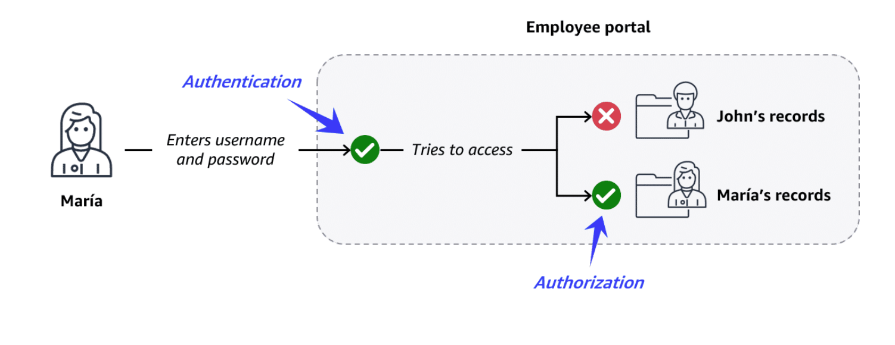
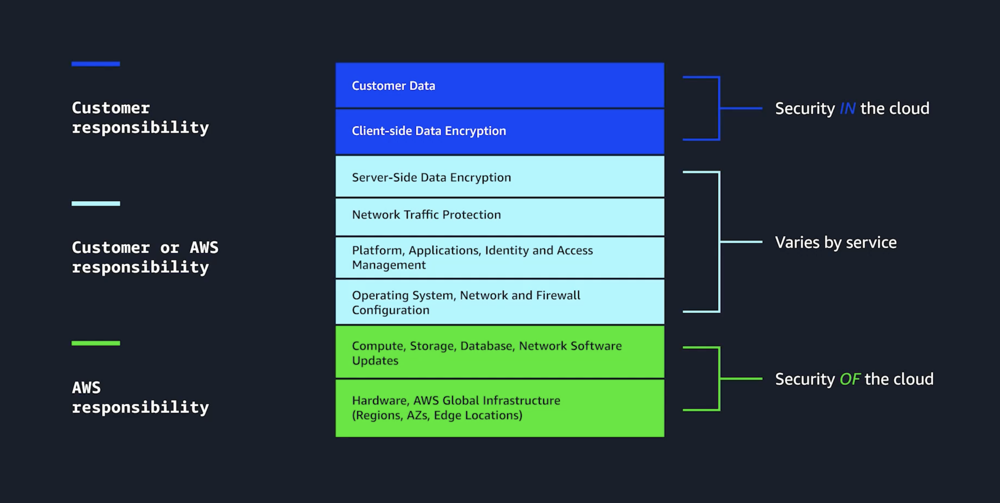
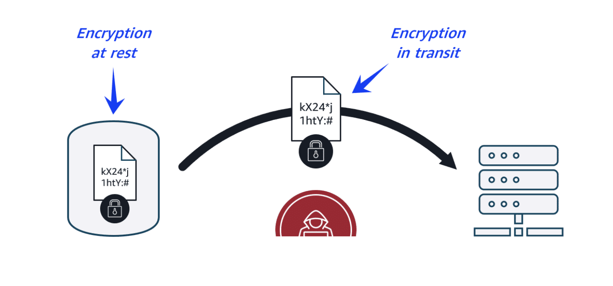

# Module 9: Security

## Introduction to Security on AWS

### Key concepts

Authentication and authorization are two core security mechanisms that help protect data and
systems.

- **Authentication**: verifies the identity of a user or entity using credentials such as a username and password.
  - Example: an employee signs in to an employee portal.

- **Authorization**: determines what actions a user is allowed to perform after authentication.
  - Example: an employee can only view their own employee records.

The diagram shows the difference between authentication (logging in) and authorization (accessing
only permitted information).

### AWS shared responsibility model

Cloud security is a shared responsibility between AWS and the customer.

1. **Customer responsibilities**: Security in the cloud
   - When using AWS services, customers retain control over their content and are responsible for securing:
     - data, systems, and applications
     - the data and workloads they choose to store or run in AWS
     - the AWS services they use
     - access to their environments and resources

2. **AWS responsibilities**: Security of the cloud
   - AWS is responsible for protecting the cloud infrastructure, including:
     - the foundational software that powers AWS services
     - the virtualization layer
     - the hardware and global infrastructure that supports AWS Regions, Availability Zones, and edge locations

### AWS security controls

AWS provides several security mechanisms to help protect cloud resources by:

- preventing security incidents through proper permission and access management
- protecting networks, applications, and data
- detecting and responding to security incidents as they occur

### Key takeaway / summary

- Authentication verifies who a user is, while authorization defines what they can do.
- AWS and the customer share security responsibilities under the AWS shared responsibility model.
- AWS security controls help prevent, protect, detect, and respond to security threats.

---

## Preventing Unauthorized Access

## AWS Identity and Access Management (IAM)

- AWS Identity and Access Management (IAM) helps you securely manage identities and access to AWS services and resources.
- One of the best ways to prevent security incidents is through proper permission and access management. With IAM, all actions are denied by default, and permissions must be granted explicitly.
- When you assign permissions, follow the **principle of least privilege**: give users and systems only the access they need and nothing more.
- IAM provides identities such as users, groups, and roles, and uses policies to define access. This allows you to control permissions based on your organization’s security and operational needs.

**Refer [IMA-Detail](IAM (Identity and Access Management).md)**

### IAM identities and controls

1. **AWS account root user**
   - The root user is the account owner and has full access to the AWS account.
   - It should be protected with a strong password and MFA.
   - For everyday work, create other IAM identities such as IAM users.

2. **IAM users**
   - An IAM user represents a person or application that interacts with AWS services and resources.
   - AWS recommends creating separate IAM users for each person who needs access.

3. **IAM groups**
   - An IAM group is a collection of IAM users.
   - Permissions assigned to a group apply to all users in that group.

4. **IAM roles**
   - An IAM role is an identity that can be assumed temporarily to gain specific permissions.
   - Roles are commonly used for applications and services that need to access other AWS resources securely.

5. **IAM policies**
   - An IAM policy is a JSON document that allows or denies access to AWS services and resources.
   - Policies can grant access to specific services, actions, or resources.

### Additional access management services

These services help enforce least privilege and improve access management across AWS environments.

- **AWS IAM Identity Center** : Sinlge sign on (SSO)
  - Centralizes identity and access management across AWS accounts and applications.
  - Supports single sign-on and federated identity management.

- **AWS Secrets Manager**
  - Securely stores and manages sensitive information such as passwords, database credentials, and API keys.
  - Helps rotate secrets safely throughout their lifecycle.

- **AWS Systems Manager**
  - Provides a centralized view of resources and helps automate tasks such as patching, user management, and configuration changes.

### Key takeaway / summary

- IAM is used to control who can access AWS resources and what they can do.
- The principle of least privilege helps reduce security risk by granting only necessary access.
- Root users, IAM users, groups, roles, and policies are the main IAM building blocks.

---

## Protecting Networks and Applications

### Network and application attacks

- Network and application protection is a key part of securing an AWS environment. Attackers may try to disrupt services using denial-of-service (DoS) or distributed denial-of-service (DDoS) attacks.
  1. **DoS attack**: floods a web application with excessive traffic so legitimate users cannot access it.
  2. **DDoS attack**: uses many infected systems, often called zombie bots, to send large amounts of traffic at once.

### AWS network and application protection

- AWS provides built-in protection against common low-level attacks through its global infrastructure, including multiple Regions, Availability Zones, and edge locations.

### Protection through infrastructure

- AWS infrastructure helps reduce attack impact through services such as:
  1. **Security groups**: allow only permitted inbound traffic at the network level.

  2. **Elastic Load Balancing (ELB)**: distributes incoming traffic to prevent one server from becoming overloaded.

  3. **AWS Regions**: provide massive capacity and scalability, making large-scale attacks much harder to overwhelm.

### Protection through services

- AWS also offers dedicated security services to protect networks and applications:
  1. **AWS Shield Standard**: automatically protects against common DDoS attacks at no extra cost.

  2. **AWS Shield Advanced**: provides advanced diagnostics and protection for more sophisticated attacks.

  3. **AWS WAF**: acts as a web application firewall by filtering requests based on rules and web ACLs.

### Key takeaway / summary

- DoS and DDoS attacks aim to overwhelm applications with traffic.
- AWS uses infrastructure and security services like Security Groups, ELB, Shield, and WAF to help protect applications.
- A layered security approach improves resilience against network and application attacks.

---

**Que**: An online boutique has recently suffered a series of targeted distributed denial of service
(DDoS) attacks. The owner wants to enhance the security of the boutique's web application using AWS
infrastructure. Which components can the boutique use to protect the web application on AWS from
DDoS attacks? (Select TWO.)

**Ans**:

1. Security groups
2. Elastic Load Balancing (ELB)

**Reasone**: Security groups make sure only traffic from authenticated users is allowed into the
system, while an ELB distributes incoming traffic to prevent any single frontend server from being
overwhelmed. Operating at the AWS network level, these components leverage the full capacity of the
AWS Region to help absorb large-scale attacks.

---

## Protecting Data

### Data encryption

Data encryption is a core part of protecting information in AWS. It helps keep applications secure
and preserves customer trust.

#### Encryption basics

- Encryption works like a lock-and-key system:
  - An encryption key transforms readable data into unreadable data.
  - A decryption key is required to recover the original information.

- For example, a customer’s profile can be encrypted so it appears as random characters until the correct key is used to read it.

#### Types of data encryption

1. **Encryption at rest**: protects data while it is stored, such as in a database or file system.

2. **Encryption in transit**: protects data while it is moving between systems, such as from a database to an application.

- SSL/TLS certificates are commonly used to establish encrypted connections. They are specifically designed to encrypt data as it moves between systems over networks.

### AWS data protection

AWS provides built-in data protection features and specialized services to help secure your data.

#### Built-in data protection

1. **Amazon S3**: new S3 buckets are encrypted by default, and uploaded objects are protected at rest.

2. **Amazon EBS**: EBS volumes and snapshots can be encrypted at rest, including boot and data volumes.

3. **Amazon DynamoDB**: server-side encryption at rest is enabled by default using keys managed in AWS KMS.

#### AWS data protection services

1. **AWS Key Management Service (AWS KMS)**: creates and manages cryptographic keys used to encrypt and decrypt data.

2. **Amazon Macie**: detects and helps protect sensitive data stored in Amazon S3 using machine learning and automation.

3. **AWS Certificate Manager (ACM)**: manages SSL/TLS certificates for encrypting data in transit.

### Key takeaway / summary

- Encryption protects data both at rest and in transit.
- AWS services like S3, EBS, and DynamoDB support encryption by default or through configuration.
- KMS, Macie, and ACM are important services for managing keys, discovering sensitive data, and securing network connections.

---

## Detecting and Responding to Security Incidents

- Preventing and protecting against security threats is essential, but you should also be prepared to detect and respond to incidents when they occur. AWS provides several services to help with this.
  1. **Amazon Inspector** : Vulnerability scanning
     - Amazon Inspector runs automated security assessments for EC2 instances, containers, and Lambda functions.
     - It helps identify vulnerabilities and deviations from security best practices.

  2. **Amazon GuardDuty** : Threat detection service
     - Amazon GuardDuty detects threats by continuously monitoring account activity, network behavior, and known malicious indicators.
     - It provides findings and recommended remediation steps.

  3. **Amazon Detective** : Security investigation and root cause analysis
     - Amazon Detective helps investigate security incidents by visualizing resource and user activity over time.
     - It is useful for understanding the root cause of a threat.
     - Detective is specifically designed for interactive analysis and investigating security threats over time using visualizations. It's a suitable choice for the team's investigation.

  4. **AWS Security Hub** : Aggregation of security findings across multiple AWS services
     - AWS Security Hub brings security findings from multiple AWS and partner services into a single view. - It helps you monitor your security posture and respond more efficiently.

### Key takeaway / summary

- Detection services identify potential threats early.
- Investigation tools help determine the root cause of incidents.
- Centralized security dashboards improve visibility and response speed.

---

## Additional Security Resources

### AWS Marketplace security resources

- The AWS Marketplace provides a digital catalog where you can purchase third-party software and services that run on AWS. This includes the following types of security services.
  1. **Threat detection and prevention tools** : Identify and block malicious activities.

  2. **Identity and access management tools** : Control user permissions and authentication.

  3. **Data protection tools** : Encrypt and safeguard sensitive information.

  4. **Compliance and governance tools** : Meet security regulatory requirements.

---
